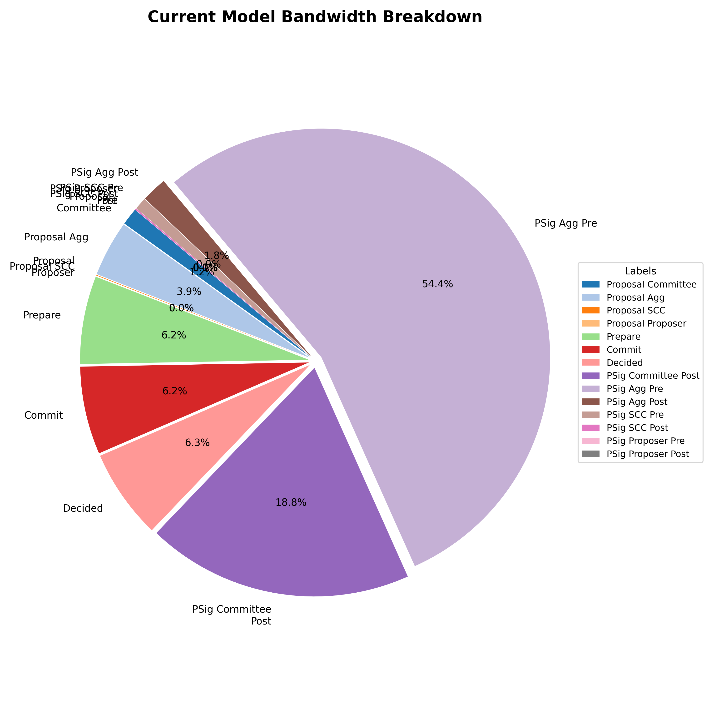
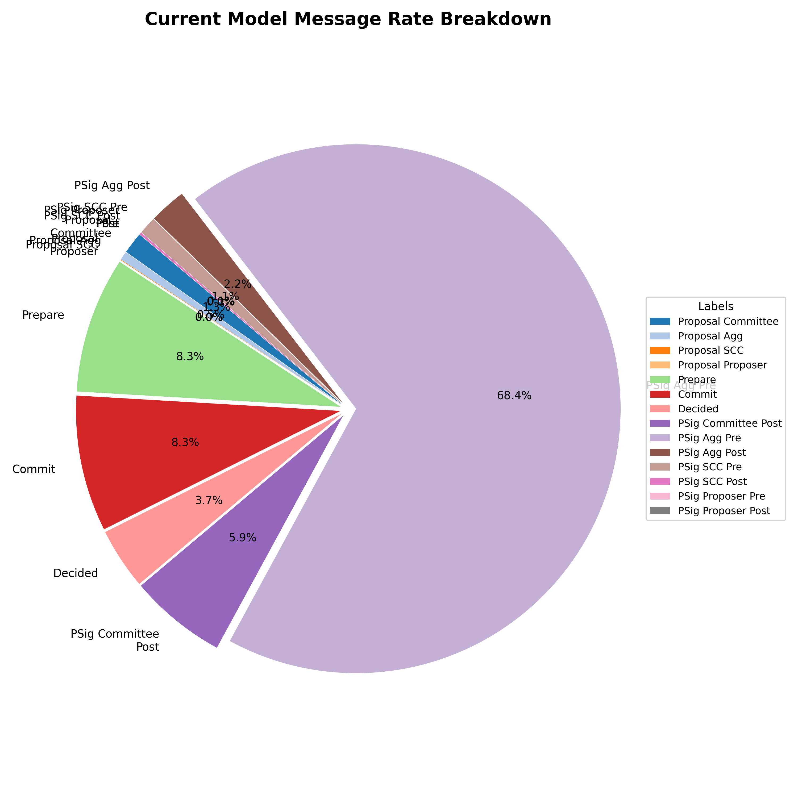
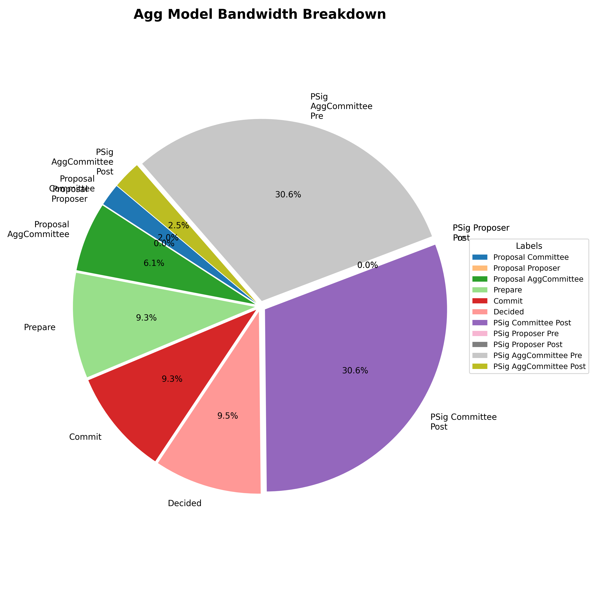
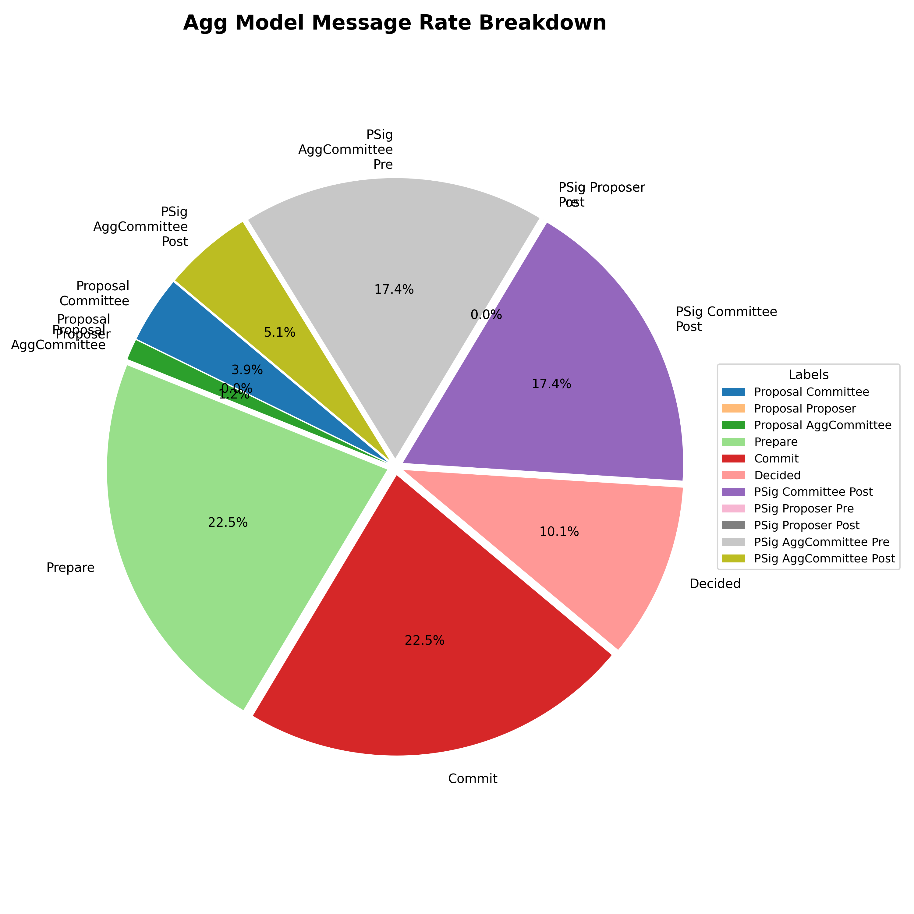

|     Author     |           Title            		|  Category  |       Status        |    Date    |
| -------------- | -------------------------------- | ---------- | ------------------- | ---------- |
| Matheus Franco | Aggregator Committee Consensus   | Core       | open-for-discussion | 2025-05-12 |

## Summary

Aggregate all `Aggregator` and `Sync Committee Contribution` slot duties per committee of operators.

## Motivation

Previously, the Alan Fork introduced [slot based consensus for attestation and sync committee duties](./committee_consensus.md).
However, a committee of operators may still perform multiple aggregation and sync committee contribution duties in parallel during the same slot.
Since both duties share the same time window in the slot, i.e. both wait for two-thirds of the slot before execution, this SIP proposes merging their execution, combining the partial signature messages and doing a unique consensus.

This change reduces the number of messages exchanged, lowers bandwidth usage, and decreases processing overhead.

## Merging Duties

### Aggregator Duty

Whenever a validator is assigned to an attestation duty, the committee of operators should also initiate the pre-consensus phase of the aggregator duty to determine whether the validator is an aggregator.

For that, operators exchange partial signatures over the duty's slot along with a domain data, as decribed in [Ethereum's specification](https://github.com/ethereum/consensus-specs/blob/dev/specs/phase0/validator.md#aggregation-selection).

```python
def get_slot_signature(state: BeaconState, slot: Slot, privkey: int) -> BLSSignature:
    domain = get_domain(state, DOMAIN_SELECTION_PROOF, compute_epoch_at_slot(slot))
    signing_root = compute_signing_root(slot, domain)
    return bls.Sign(privkey, signing_root)

def is_aggregator(state: BeaconState, slot: Slot, index: CommitteeIndex, slot_signature: BLSSignature) -> bool:
    committee = get_beacon_committee(state, slot, index)
    modulo = max(1, len(committee) // TARGET_AGGREGATORS_PER_COMMITTEE)
    return bytes_to_uint64(hash(slot_signature)[0:8]) % modulo == 0
```

If the validator is indeed an aggregator, the consensus phase is executed to decide on a common `AggregateAndProof` object.

```py
class AggregateAndProof(Container):
    aggregator_index: ValidatorIndex
    aggregate: Attestation
    selection_proof: BLSSignature

# Before Electra
class Attestation(Container):
    aggregation_bits: Bitlist[MAX_VALIDATORS_PER_COMMITTEE]
    data: AttestationData
    signature: BLSSignature

# After Electra
class Attestation(Container):
    aggregation_bits: Bitlist[MAX_VALIDATORS_PER_COMMITTEE * MAX_COMMITTEES_PER_SLOT]
    data: AttestationData
    signature: BLSSignature
    committee_bits: Bitvector[MAX_COMMITTEES_PER_SLOT]
```

In the post consensus phase, operators share signatures over `AggregateAndProof` to construct and submit a `SignedAggregateAndProof`.

```py
class SignedAggregateAndProof(Container):
    message: AggregateAndProof
    signature: BLSSignature
```

The partial signatures are validator-specific, as they are determined by the validators' key shares.
The consensus data, `AggregateAndProof`, includes the validator index, selection proof, and an `Attestation` that depends only on the beacon committee.

To optimize bandwidth when merging multiple duties, validators and their selection proofs can be listed separately, while `Attestation` objects are included only once per beacon committee.

### Sync Committee Contributor Duty

Similar to attestation aggregation, whenever a validator is assigned to a sync committee duty, the operators initiate a pre-consensus phase for the sync committee contribution duty to determine whether the validator is an aggregator.

For that, operators exchange partial signatures over a `SyncAggregatorSelectionData` object along with a domain data, as decribed in [Ethereum's specification](https://github.com/ethereum/consensus-specs/blob/dev/specs/altair/validator.md#aggregation-selection).

```python
def get_sync_committee_selection_proof(state: BeaconState,
                                       slot: Slot,
                                       subcommittee_index: uint64,
                                       privkey: int) -> BLSSignature:
    domain = get_domain(state, DOMAIN_SYNC_COMMITTEE_SELECTION_PROOF, compute_epoch_at_slot(slot))
    signing_data = SyncAggregatorSelectionData(
        slot=slot,
        subcommittee_index=subcommittee_index,
    )
    signing_root = compute_signing_root(signing_data, domain)
    return bls.Sign(privkey, signing_root)
def is_sync_committee_aggregator(signature: BLSSignature) -> bool:
    modulo = max(1, SYNC_COMMITTEE_SIZE // SYNC_COMMITTEE_SUBNET_COUNT // TARGET_AGGREGATORS_PER_SYNC_SUBCOMMITTEE)
    return bytes_to_uint64(hash(signature)[0:8]) % modulo == 0
```

If the validator is indeed a sync committee aggregator, the consensus phase is executed to decide on a common `Contributions` object:

```go
type Contributions []*Contribution

type Contribution struct {
	SelectionProofSig [96]byte `ssz-size:"96"`
	Contribution      altair.SyncCommitteeContribution
}
```
```py
class SyncCommitteeContribution(Container):
    slot: Slot
    beacon_block_root: Root
    subcommittee_index: uint64
    aggregation_bits: Bitvector[SYNC_COMMITTEE_SIZE // SYNC_COMMITTEE_SUBNET_COUNT]
    signature: BLSSignature
```

In the post-consensus phase, operators share signatures over `ContributionAndProof` objects to construct and submit a `SignedContributionAndProof`.

```py
class ContributionAndProof(Container):
    aggregator_index: ValidatorIndex
    contribution: SyncCommitteeContribution
    selection_proof: BLSSignature

class SignedContributionAndProof(Container):
    message: ContributionAndProof
    signature: BLSSignature
```

As with attestation aggregation duties, the partial signatures are validator-specific.
`Contribution` holds a validator-specific selection proof along with a `SyncCommitteeContribution` object that only depends on the sync committee subnet.
Again, the validators may be listed with their associated selection proof and beacon committee, while `SyncCommitteeContribution` can be included only once per beacon committee.

## Spec changes

### New Domain
This is a fork and a new domain must be added:

```go
DomainType{0x0, 0x0, MainnetNetworkID.Byte(), 0x2}
```

### Role

This is used to route the message to the correct runner.
`RoleAggregator` and `RoleSyncCommitteeContribution` will be decrepacated in favour of `RoleAggregatorCommittee`.

```go
type RunnerRole int32

const (
	RoleCommittee RunnerRole = iota
	RoleAggregatorCommittee
	RoleProposer

	RoleValidatorRegistration
	RoleVoluntaryExit

	RoleUnknown = -1
)
```

### Design

Similarly to the [committee consensus SIP](./committee_consensus.md), the `AggregatorRunner` and `SyncCommitteeAggregatorRunner` runners will be replaced by a `AggregatorCommitteeRunner`, which will be called by `Committee` in order to process consensus and partial signature messages for the aggregator roles.

The `Committee` will hold a `AggregatorCommitteeRunner` object for each slot it is running a beacon duty for.

### MessageID

Messages associated to the `AggregatorRunner` and `SyncCommitteeAggregatorRunner` used to include a `ValidatorPublicKey` in `MessageID`.
On the other hand, `AggregatorCommitteeRunner` sends messages with respect to the committee of operators and, thus, it will use `CommitteeID` in `MessageID`.
Because `CommitteeID` is 32 bytes long, it's encoded with a `0x00` 16 bytes prefix to make it the same length as a `ValidatorPublicKey` would have.


#### `PartialSignatureMessages`

The current structures will remain unchanged as the pair (`ValidatorIndex`,`SigningRoot`) uniquely identifies a (validator, beacon role, beacon committee) tuple due to the non-collision property of the hashed signing root.

```go
type PartialSignatureMessage struct {
	PartialSignature Signature `ssz-size:"96"`
	SigningRoot      [32]byte  `ssz-size:"32"`
	Signer         	 OperatorID
	ValidatorIndex   phase0.ValidatorIndex
}
```

#### Consensus Data: `AggregatorConsensusData`

We introduce a new type to be used as consensus data for the `AggregatorCommitteeRunner`.

```go
type AssignedAggregator struct {
	ValidatorIndex 		phase0.ValidatorIndex
	SelectionProof 		phase0.BLSSignature
	CommitteeIndex  	uint64
}

type AggregatorConsensusData struct {
	Version spec.DataVersion // Beacon version

	// Aggregator duties
	Aggregators     []AssignedAggregator

	AggregatorsCommitteeIndexes  []uint64 // ordered unique list of the existing beacon committees, i.e. a subset of the [1,...,64] list
	Attestations     			 [][]byte // list of encoded phase0.Attestation or electra.Attestation (depending on the version), one for each beacon committee index

	// Sync Committee Duties
	Contributors 				[]AssignedAggregator

	SyncCommitteeIndexes 		[]uint64 // ordered unique list of the existing sync committee subnets, i.e. a subset of the [1,2,3,4] list
	SyncCommitteeContributions  []altair.SyncCommitteeContribution // one for each sync committee subnet
}
```

## Improvement

We evaluated the performance of the proposed change using a Monte Carlo simulation with a single committee with 1k validators, assigning beacon duties over 100 epochs.

| Metric                                 | Current | New  | New/Current% |
|----------------------------------------|---------|------|--------------|
| **Messages/s**                         | 13.15   | 2.39 | 18%          |
| **Bandwidth (KB/s)**                   | 8.55    | 4.56 | 53%          |
| **Average size Per Message (KB/msgs)** | 0.65    | 1.90 | 292%         |

- The **number of messages** dropped to 18% of the original value, mainly due to pre-consensus messages for the aggregator role being grouped into a single message per committee.
- **Bandwidth** dropped to 53%, though the reduction is less dramatic because merging the messages increased individual message size. This is reflected in the **average message size** increasing by 290%.

We also evaluated a larger committee with 3k validators.

| Metric                                 | Current | New   | New/Current% |
|----------------------------------------|---------|-------|--------------|
| **Messages/s**                         | 37.17   | 2.77  | 7%           |
| **Bandwidth (KB/s)**                   | 24.52   | 11.53 | 47%          |
| **Average size Per Message (KB/msgs)** | 0.66    | 4.15  | 629%         |

Both message rate and bandwidth saw even greater improvements, though the average message size significantly increased over 600%.

Finally, we evaluated the performance on the current Mainnet state with 109.5k validators, 1.3k operators and 700 committees.

| Metric                                 | Current | New    | New/Current% |
|----------------------------------------|---------|--------|--------------|
| **Messages/s**                         | 1782.70 | 607.76 | 34%          |
| **Bandwidth (KB/s)**                   | 1128.07 | 693.85 | 61%          |
| **Average size Per Message (KB/msgs)** | 0.63    | 1.14   | 180%         |

The gains are less pronounced compared to the 1k-committee scenario, but this is expected as Mainnet has several smaller committees that benefit less from the duties merging.

We also tracked how the rate and bandwidth changed for each message type.

<p align="center">


</p>
<p align="center">


</p>

Pre-consensus messages for the aggregator role used to dominate both in quantity as in bandwidth.
After merging, pre-consensus for the aggregator committee duty became dominant along with post-consensus for the committee duty, which is expected as an attestation duty triggers exactly one of each.

## P2P

TODO

### Message Validation

TODO

### GossipSub Scoring

TODO

## Drawbacks

TODO
