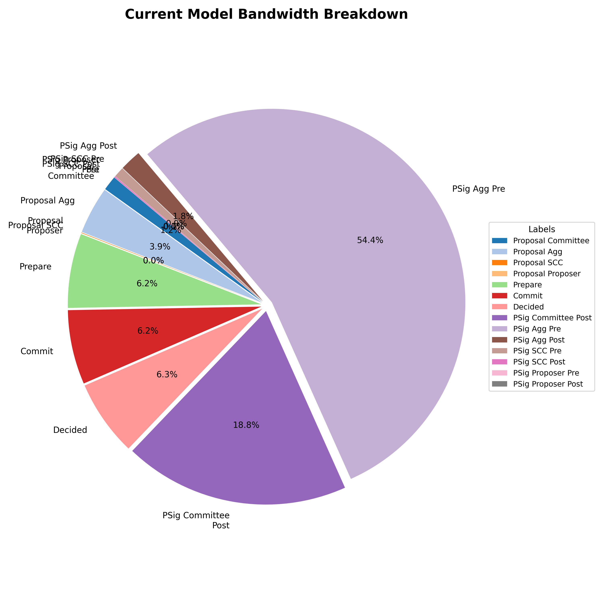
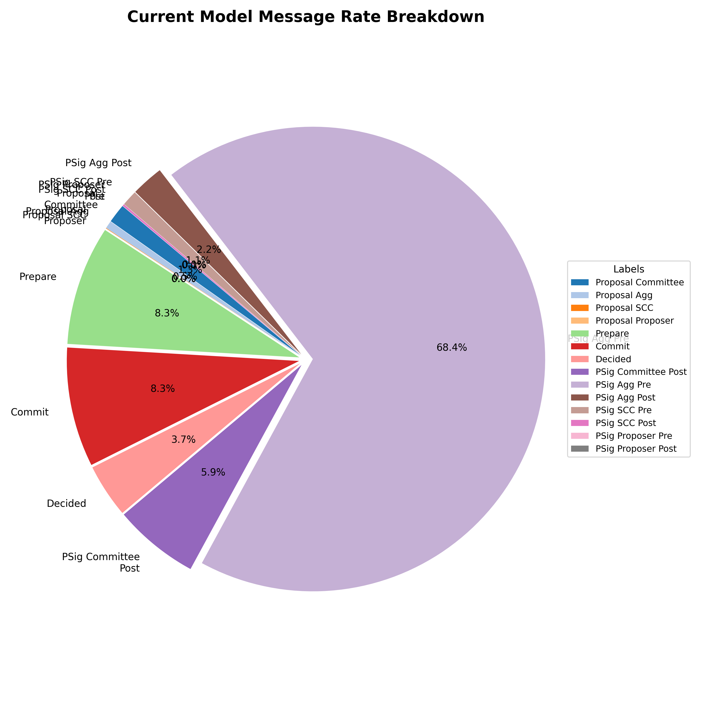
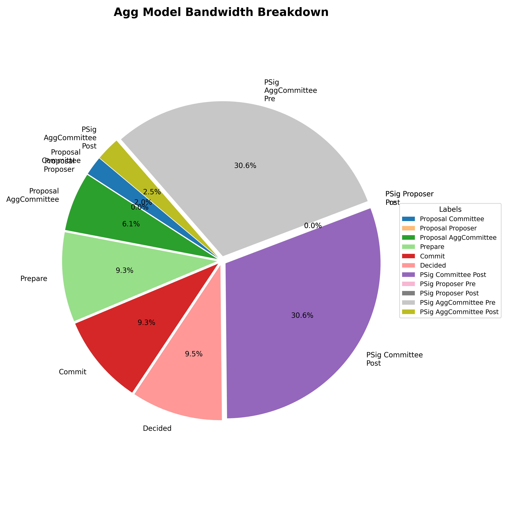
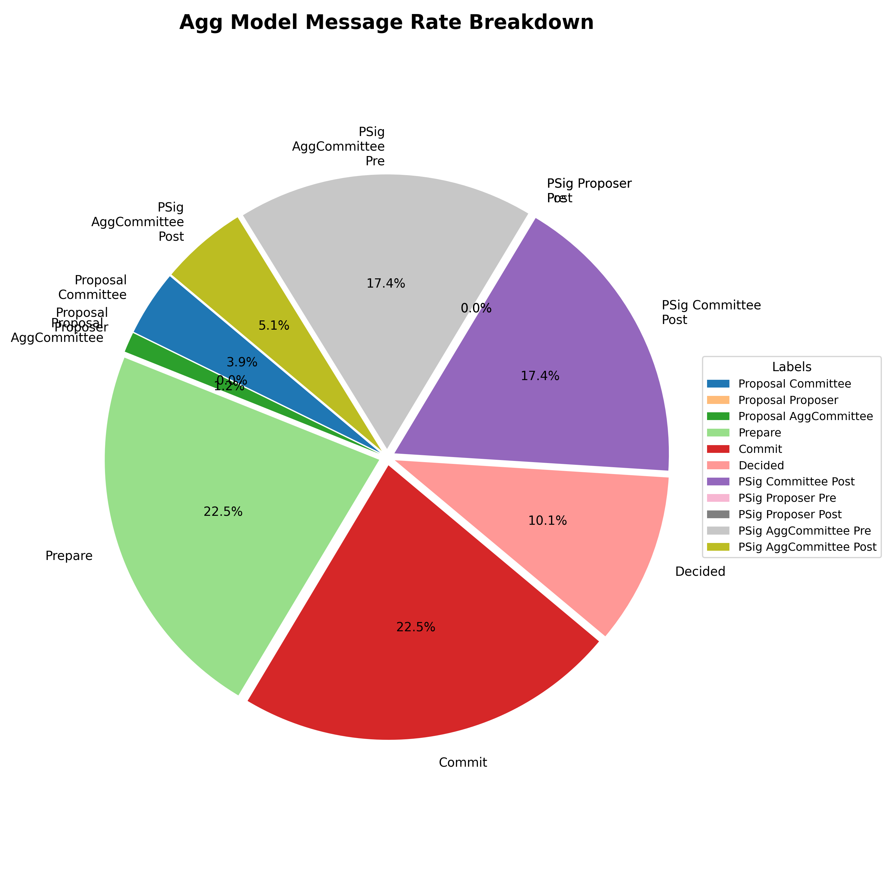

|     Author     |           Title            		|  Category  |       Status        |    Date    |
| -------------- | -------------------------------- | ---------- | ------------------- | ---------- |
| Matheus Franco | Aggregator Committee Consensus   | Core       | open-for-discussion | 2025-05-12 |

## Summary

Aggregate all `Aggregator` and `Sync Committee Contribution` slot duties per committee of operators.

## Motivation

Previously, the Alan Fork introduced [slot based consensus for attestation and sync committee duties](./committee_consensus.md).
However, a committee of operators may still perform multiple aggregation and sync committee contribution duties in parallel during the same slot.
Since both duties share the same time window in the slot, i.e. both wait for two-thirds of the slot before execution, this SIP proposes merging their execution, combining the partial signature messages and doing a unique consensus.

This change reduces the number of messages exchanged, lowers bandwidth usage, and decreases processing overhead.

## Improvements

We evaluated the performance of the proposed change using a Monte Carlo simulation with a single committee with 1k validators, assigning beacon duties over 100 epochs.

| Metric                                 | Current | New  | Change (%) |
|----------------------------------------|---------|------|------------|
| **Messages/s**                         | 13.15   | 2.39 | -82%       |
| **Bandwidth (KB/s)**                   | 8.55    | 4.56 | -47%       |
| **Average size Per Message (KB/msgs)** | 0.65    | 1.90 | +192%      |

- The **number of messages** dropped to 18% of the original value, mainly due to pre-consensus messages for the aggregator role being grouped into a single message per committee.
- **Bandwidth** dropped to 53%, though the reduction is less dramatic because merging the messages increased individual message size. This is reflected in the **average message size** increasing by 290%.

We also evaluated a larger committee with 3k validators.

| Metric                                 | Current | New   | Change (%) |
|----------------------------------------|---------|-------|------------|
| **Messages/s**                         | 37.17   | 2.77  | -93%       |
| **Bandwidth (KB/s)**                   | 24.52   | 11.53 | -53%       |
| **Average size Per Message (KB/msgs)** | 0.66    | 4.15  | +529%      |

Both message rate and bandwidth saw even greater improvements, though the average message size significantly increased over 600%.

Finally, we evaluated the performance on the current Mainnet state with 109.5k validators, 1.3k operators and 700 committees.

| Metric                                 | Current | New    | Change (%) |
|----------------------------------------|---------|--------|------------|
| **Messages/s**                         | 1782.70 | 607.76 | -66%       |
| **Bandwidth (KB/s)**                   | 1128.07 | 693.85 | -39%       |
| **Average size Per Message (KB/msgs)** | 0.63    | 1.14   | +80%       |

The gains are less pronounced compared to the 1k-committee scenario, but this is expected as Mainnet has several smaller committees that benefit less from the duties merging.

We also tracked how the rate and bandwidth changed for each message type.

<p align="center">


</p>
<p align="center">


</p>

Pre-consensus messages for the aggregator role used to dominate both in quantity as in bandwidth.
After merging, pre-consensus for the aggregator committee duty became dominant along with post-consensus for the committee duty, which is expected as an attestation duty triggers exactly one of each.

## Merging Duties

### Aggregator Duty

Whenever a validator is assigned to an attestation duty, the committee of operators should also initiate the pre-consensus phase of the aggregator duty to determine whether the validator is an aggregator.

For that, operators exchange partial signatures over the duty's slot along with a domain data, as described in [Ethereum's specification](https://github.com/ethereum/consensus-specs/blob/dev/specs/phase0/validator.md#aggregation-selection).

```python
def get_slot_signature(state: BeaconState, slot: Slot, privkey: int) -> BLSSignature:
    domain = get_domain(state, DOMAIN_SELECTION_PROOF, compute_epoch_at_slot(slot))
    signing_root = compute_signing_root(slot, domain)
    return bls.Sign(privkey, signing_root)

def is_aggregator(state: BeaconState, slot: Slot, index: CommitteeIndex, slot_signature: BLSSignature) -> bool:
    committee = get_beacon_committee(state, slot, index)
    modulo = max(1, len(committee) // TARGET_AGGREGATORS_PER_COMMITTEE)
    return bytes_to_uint64(hash(slot_signature)[0:8]) % modulo == 0
```

If the validator is indeed an aggregator, the consensus phase is executed to decide on a common `AggregateAndProof` object.

```py
class AggregateAndProof(Container):
    aggregator_index: ValidatorIndex
    aggregate: Attestation
    selection_proof: BLSSignature

# Before Electra
class Attestation(Container):
    aggregation_bits: Bitlist[MAX_VALIDATORS_PER_COMMITTEE]
    data: AttestationData
    signature: BLSSignature

# After Electra
class Attestation(Container):
    aggregation_bits: Bitlist[MAX_VALIDATORS_PER_COMMITTEE * MAX_COMMITTEES_PER_SLOT]
    data: AttestationData
    signature: BLSSignature
    committee_bits: Bitvector[MAX_COMMITTEES_PER_SLOT]
```

In the post consensus phase, operators share signatures over `AggregateAndProof` to construct and submit a `SignedAggregateAndProof`.

```py
class SignedAggregateAndProof(Container):
    message: AggregateAndProof
    signature: BLSSignature
```

The partial signatures are validator-specific, as they are determined by the validators' key shares.
The consensus data, `AggregateAndProof`, includes the validator index, selection proof, and an `Attestation` that depends only on the beacon committee.

To optimize bandwidth when merging multiple duties, validators and their selection proofs can be listed separately, while `Attestation` objects are included only once per beacon committee.

### Sync Committee Contributor Duty

Similar to attestation aggregation, whenever a validator is assigned to a sync committee duty, the operators initiate a pre-consensus phase for the sync committee contribution duty to determine whether the validator is an aggregator.

For that, operators exchange partial signatures over a `SyncAggregatorSelectionData` object along with a domain data, as described in [Ethereum's specification](https://github.com/ethereum/consensus-specs/blob/dev/specs/altair/validator.md#aggregation-selection).

```python
def get_sync_committee_selection_proof(state: BeaconState,
                                       slot: Slot,
                                       subcommittee_index: uint64,
                                       privkey: int) -> BLSSignature:
    domain = get_domain(state, DOMAIN_SYNC_COMMITTEE_SELECTION_PROOF, compute_epoch_at_slot(slot))
    signing_data = SyncAggregatorSelectionData(
        slot=slot,
        subcommittee_index=subcommittee_index,
    )
    signing_root = compute_signing_root(signing_data, domain)
    return bls.Sign(privkey, signing_root)
def is_sync_committee_aggregator(signature: BLSSignature) -> bool:
    modulo = max(1, SYNC_COMMITTEE_SIZE // SYNC_COMMITTEE_SUBNET_COUNT // TARGET_AGGREGATORS_PER_SYNC_SUBCOMMITTEE)
    return bytes_to_uint64(hash(signature)[0:8]) % modulo == 0
```

If the validator is indeed a sync committee aggregator, the consensus phase is executed to decide on a common `Contributions` object:

```go
type Contributions []*Contribution

type Contribution struct {
	SelectionProofSig [96]byte `ssz-size:"96"`
	Contribution      altair.SyncCommitteeContribution
}
```
```py
class SyncCommitteeContribution(Container):
    slot: Slot
    beacon_block_root: Root
    subcommittee_index: uint64
    aggregation_bits: Bitvector[SYNC_COMMITTEE_SIZE // SYNC_COMMITTEE_SUBNET_COUNT]
    signature: BLSSignature
```

In the post-consensus phase, operators share signatures over `ContributionAndProof` objects to construct and submit a `SignedContributionAndProof`.

```py
class ContributionAndProof(Container):
    aggregator_index: ValidatorIndex
    contribution: SyncCommitteeContribution
    selection_proof: BLSSignature

class SignedContributionAndProof(Container):
    message: ContributionAndProof
    signature: BLSSignature
```

As with attestation aggregation duties, the partial signatures are validator-specific.
`Contribution` holds a validator-specific selection proof along with a `SyncCommitteeContribution` object that only depends on the sync committee subnet.
Again, the validators may be listed with their associated selection proof and beacon committee, while `SyncCommitteeContribution` can be included only once per beacon committee.

## Spec changes

### Role

This is used to route the message to the correct runner.
`RoleAggregator` and `RoleSyncCommitteeContribution` will be deprecated in favour of `RoleAggregatorCommittee`.

```go
type RunnerRole int32

const (
	RoleCommittee RunnerRole = iota
	RoleAggregatorCommittee
	RoleProposer

	RoleValidatorRegistration
	RoleVoluntaryExit

	RoleUnknown = -1
)
```

### Design

Similarly to the [committee consensus SIP](./committee_consensus.md), the `AggregatorRunner` and `SyncCommitteeAggregatorRunner` runners will be replaced by a `AggregatorCommitteeRunner`, which will be called by `Committee` in order to process consensus and partial signature messages for the aggregator roles.

The `Committee` will hold a `AggregatorCommitteeRunner` object for each slot it is running a beacon duty for.

### MessageID

Messages associated to the `AggregatorRunner` and `SyncCommitteeAggregatorRunner` used to include a `ValidatorPublicKey` in `MessageID`.
On the other hand, `AggregatorCommitteeRunner` sends messages with respect to the committee of operators and, thus, it will use `CommitteeID` in `MessageID`.
Because `CommitteeID` is 32 bytes long, it's encoded with a `0x00` 16 bytes prefix to make it the same length as a `ValidatorPublicKey` would have.


#### `PartialSignatureMessages`

The current structures will remain unchanged as the pair (`ValidatorIndex`,`SigningRoot`) uniquely identifies a (validator, beacon role, beacon committee) tuple due to the non-collision property of the hashed signing root.

```go
type PartialSignatureMessages struct {
    Type     PartialSigMsgType
    Slot     phase0.Slot
    Messages []*PartialSignatureMessage `ssz-max:"5048"` // 3000 + 512*4 (worst-case scenario)
}

type PartialSignatureMessage struct {
	PartialSignature Signature `ssz-size:"96"`
	SigningRoot      [32]byte  `ssz-size:"32"`
	Signer         	 OperatorID
	ValidatorIndex   phase0.ValidatorIndex
}
```

The new possible `PartialSigMsgType` values are updated in the following way:
```go
const (
    // PostConsensusPartialSig is a partial signature over a decided duty (attestation data, block, etc)
    PostConsensusPartialSig PartialSigMsgType = iota // 0
    // RandaoPartialSig is a partial signature over randao reveal
    RandaoPartialSig // 1
    // SelectionProofPartialSig is a partial signature for aggregator selection proof
    SelectionProofPartialSig // 2
    // ContributionProofs is the partial selection proofs for sync committee contributions (it's an array of sigs)
    ContributionProofs // 3
    // ValidatorRegistrationPartialSig is a partial signature over a ValidatorRegistration object
    ValidatorRegistrationPartialSig // 4
    // VoluntaryExitPartialSig is a partial signature over a VoluntaryExit object
    VoluntaryExitPartialSig // 5
    // AggregatorCommitteePartialSig is a partial signature for combined aggregator and sync committee selection proofs
    AggregatorCommitteePartialSig // 6
)
```


#### Pre-Consensus Phase

Differently from the `CommitteeRunner` used for attestations and sync-committee duties,
the `AggregatorCommitteeRunner` includes a pre-consensus phase.
In such a phase, operators exchange a `PartialSignatureMessages`
with one `PartialSignatureMessage` for each validator duty in the committee.
Note that, while a possible aggregator duty incurs only one `PartialSignatureMessage`,
a validator may be assigned to up to four sync committee contribution duties,
thus possibly requiring four `PartialSignatureMessages`.
The `PartialSignatureMessages.Type` is set to the new type `AggregatorCommitteePartialSig`.

The pre-consensus phase ends on the following scenarios:
1. All validators are confirmed not to be selected as an aggregator/contributor.
2. At least one validator is confirmed to be selected as an aggregator/contributor.

> [!TIP] 
> Note that, according to the weak condition (2), even if the selection cannot
be determined for a subset of validators, the pre-consensus phase
will still proceed to the consensus phase and these validators won't be included on it.
> Although it seems counter-intuitive to do so,
> that's necessary for ensuring liveness,
> in a context with BFT assumptions
> and due to the possibility of invalid signatures/validators miss
> associated with different smart-contract state views.
> 
> How can this happen in more concrete terms?
> Let $V_i$ be the validators set (of the committee) in the perspective of operator $O_i$.
> - Operators have different views of the current SSV smart-contract state (e.g. only one is aware of a new validator that joined the committee).
> In this case, the operator $O_i$ will only possibly select validators $V_i \cap (\bigcup_{j\neq i}V_j)$.
> - Suppose byzantine operators send a valid signature only for $v\in V_e$ and invalid ones for all other validators.
> Once a quorum is reached, honest operators may be restricted to advance to consensus only with the duty for $v$.
> Note that in case it receives an all-honest quorum, it may still be able to advance to consensus with more validators than just $v$.
> 
> While this solution prioritizes liveness over completeness,
> it's acceptable for now as the worst-case scenarios are marginally expected.
> Still, our context may be formally linked to the *Interactive Consistency*
> problem, presented in the [*Reaching Agreement in the Presence of Faults*](https://lamport.azurewebsites.net/pubs/reaching.pdf)
> paper, and more robust solutions may be explored in the future ([example](https://cgi.di.uoa.gr/~mema/publications/ic-extended.pdf)).


#### Consensus Data: `AggregatorConsensusData`

We introduce a new type to be used as consensus data for the `AggregatorCommitteeRunner`.

```go
type AssignedAggregator struct {
	ValidatorIndex 		phase0.ValidatorIndex
	SelectionProof 		phase0.BLSSignature
	CommitteeIndex  	uint64
}

type AggregatorConsensusData struct {
	Version spec.DataVersion // Beacon version

	// Aggregator duties
	Aggregators     []AssignedAggregator
    // unique list of the existing beacon committees, i.e., a subset of the [1,...,64] list
	AggregatorsCommitteeIndexes  []uint64
	// list of ssz encoded phase0.Attestation or electra.Attestation (depending on the version), one for each beacon committee index
	AggregatedAttestations     	 [][]byte

	// Sync Committee Duties
	Contributors 				[]AssignedAggregator
    // one for each sync committee subnet (1 to 4). Note that each element includes the subcommittee_index field.
	SyncCommitteeContributions  []altair.SyncCommitteeContribution
}
```

#### Post-Consensus Phase

The post-consensus phase is executed similarly to the existing `CommitteeRunner`.
It accepts all `PartialSignatureMessages` with type `PostConsensusPartialSig`
until either all duties are submitted or all messages are received (from all operators, not only necessarily a quorum),
and submits duties in a best-effort manner.
Namely, whenever a valid quorum is received and a valid signature is produced,
the associated duty is submitted to the beacon chain.


## P2P

### Message Validation

- `SSVMessage.MsgID` must include a CommitteeID encoded with a 16-byte 0x00 prefix to match `ValidatorPublicKey` length. If the CommitteeID doesn't exist in the current network, it should ignore the message.
- If a `ValidatorIndex` in `SignedPartialSignatureMessage.Message.Messages` is incorrect, considering the `ValidatorPublicKey` or the `CommitteeID` in the `MessageID`, it should ignore the message.
- If the same `ValidatorIndex` appears more than 5 times in a `PartialSignatureMessages`, the message is rejected.
