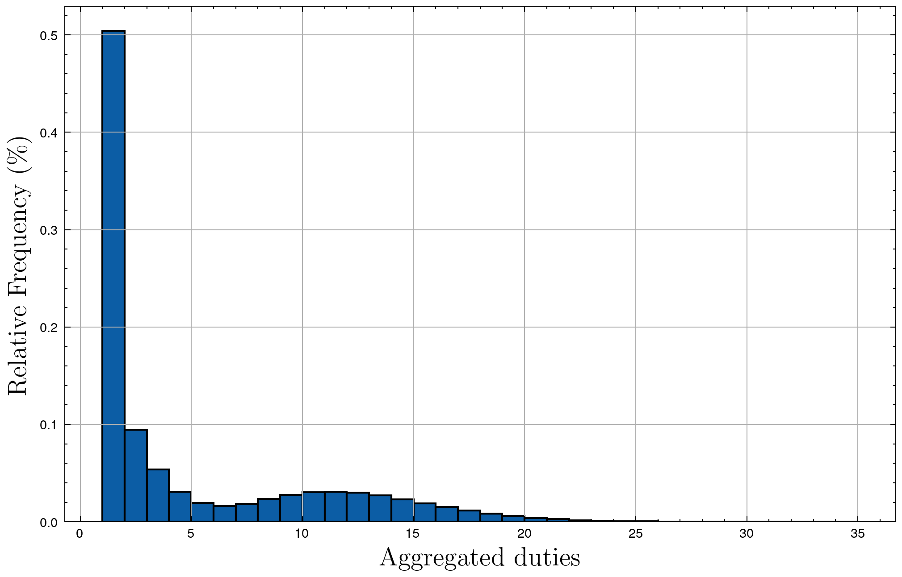

|     Author     |           Title            |  Category  |       Status        |    Date    |
| -------------- | -------------------------- | ---------- | ------------------- | ---------- |
| Matheus Franco, Gal Rogozinski | Cluster consensus          | Core       | open-for-discussion | 2024-03-05 |

## Summary

Aggregate `Attestation` and `Sync Committee` duties based on the cluster of operators and the duties' slot. 

## Motivation

With the current design, a cluster of operators associated with several validators may end up performing more than one attestation or sync committee duties on equivalent data. This proposal helps to decrease the number of messages exchanged in the network and the processing cost.

## Rationale

The aggregation of duties is possible because the data that must be agreed on is independent of the validator.

For example, take a look at the `AttestationData` type.
```go
type AttestationData struct {
	Slot            Slot
	Index           CommitteeIndex
	BeaconBlockRoot Root `ssz-size:"32"`
	Source          *Checkpoint
	Target          *Checkpoint
}
```
The only validator-dependent field is `CommitteeIndex` and it does not have to be agreed on.

For the `Sync Committee` duty, operators agree on a `phase0.Root` data which is also independent of the validator.

## Improvement

According to Monte Carlo simulations using a dataset based on the Mainnet, this proposal reduces to $21.60$% the current number of messages exchanged in the network. Note that this result includes aggregating the post-consensus messages into a single message.

Regarding the number of bits exchanged, we estimate that this proposal will reduce the current value to, at least, $52.96$%. Notice that this reduction is not as significant as the number of messages reduction due to the larger post-consensus messages.

Again with Monte Carlo simulations using the Mainnet dataset, the number of attestation duties aggregated presented the following distribution.

<p align="center">

</p>

## Spec changes

### Design

Under the new design we will have a `Cluster` object that will be the top level object in charge of processing consensus messages and partial signature messages for the attestation and sync committee roles.

The `Cluster` will hold a `ClusterRunner` object for each slot it is running a beacon duty for.

For other duty roles the old design will remain.

#### Code

```go
// Cluster is a cluster of a unique set of operators that run the same validator set
type Cluster interface {
	// Initializes and starts the runner for the duties for the given slot
  	Start(slot spec.Slot, attesterDuties []*types.Duty, syncCommitteeDuties []*types.Duty) error
	// ProcessMessage processes a message routed to this Cluster
	ProcessMessage(msg *types.SSVMessage)
}

type Cluster struct {
	ClusterRunners     map[spec.Slot]ClusterRunner
	Network           Network
	Beacon            BeaconNode
	OperatorID        OperatorID
	ClusterShares     [spec.ValidatorPubKey]ClusterShares
}

// ClusterShare Partial Validator info needed for cluster duties
type ClusterShare interface {
	getSharePubKey()      []byte
	getCommittee()        []*Operator
	getQuorum()           uint64
	getPartialQuorum() 	  uint64
	getSigner()           BeaconSigner
	// highestAttestingSlot holds the highest slot for which attester duty ran for a validator
	highestAttestingSlot spec.Slot
}


// ClusterRunner manages the duty cycle for a certain slot
type ClusterRunner interface {
	// Start the duty lifecycle for the given slot. Emits a message.
    StartDuties(slot spec.Slot, attesterDuties []*types.Duty, syncCommitteeDuties []*types.Duty) error
	// Processes cosensus message
    ProcessConsensus(consensusMessage *qbft.Message) error
	// Processes a post-consensus message
	ProcessPostConsensus(msg ClusterSignaturesMessage) 
}

type ClusterRunner struct {
	Share          *types.Share
	QBFTController *qbft.Controller
	BeaconNetwork  *types.BeaconNetwork
	Signer		   *types.BeaconSigner
}

// BeaconVote is the consensus data
type BeaconVote struct {
    BlockRoot         phase0.Root
    Source            phase0.Checkpoint
    Target            phase0.Checkpoint
}

// PartialSignature holds the ValidatorIndex, Root, and Signature
type PartialSignature struct {
    ValidatorIndex phase0.ValidatorIndex
    Root phase0.Root // TODO: is it really needed?
    Signature phase0.BLSSignature
}

// ClusterSignaturesMessage holds all PartialSignatures
type ClusterSignaturesMessage struct {
    Signer types.OperatorID
    Attestations []PartialSignature
    SyncCommitteeMessages []PartialSignature
}

func ConstructAttestation(vote BeaconVote, duty AttesterDuty) Attestation {
    bits := bitfield.New(duty.CommitteeLength)
    bits.Set(duty.ValidatorCommitteeIndex)

    return Attestation{
        Slot: duty.Slot,
        BlockRoot: vote.BlockRoot,
        Source: vote.Source,
        Target: vote.Target,
        CommiteeIndex: duty.CommitteeIndex,
        AggregationBits: bits,
    }
}
```

#### Happy Flow

1. `Cluster` receives duties that match a certain slot. If the slot is higher then `highestDecidedSlot` starts consensus for the relevant roles, and initializes a `ClusterRunner` for the relevant Validators.
2. `Cluster` receives consensus messages and hands them over `ClusterRunner` that hands them over to the `QBFTController` that has unchanged logic. The only difference is `BeaconVote` is used as the ConsensusData object.
3.  Once `ProcessConsensus` decides, the `Cluster` will create a post consensus of PartialSignatureMessage that aggregates the beacon partial signature for all relevant validators.
4. `Cluster` will process post-consensus partial signature messages and submit a beacon message for each validator.

### Stopping Runs

Previously we have letted new validator duties stop the run for the previous duty. For a cluster this is not a good idea and instead we will count on a tuned `CutOffRound` per duty to stop the instance.

### Omitting Partial Signatures

If in post-consensus stage for attestation duty, the duty's slot is lower than a validator's `ClusterShare's` `highestAttestingSlot`, the `ClusterRunner` will omit the post-consesnus message for this validator. 

#### Sync Committee
`CutOffRound = 4  \\ one slot`

#### Attestation
`CutOffRound = 12 \\ one epoch`

### ClusterID

An identifier for cluster must be added to `MessageID`.

```go
[48]byte ClusterID

// Return a 48 bytes ID for the cluster of operators
func getClusterID(operatorIDs []OperatorID) ClusterID {
	// Create a 16 bytes constant prefix for cluters
	const prefix = []byte{0x00}

	// return the sha256 of the sortedIDs
	return ClusterID(prefix + sha256.Sum256(bytes(sorted(operatorIDs))))
}
```

In order to route consensus messages to the correct consensus runner, the `ClusterID` field will be included in the `MessageID` replacing `ValidatorPublicKey`.


#### Prefix Rationale

The 16 bytes prefix we are creating elongates the `ClusterID` to 48 bytes. The same length as `ValidatorPublicKey`. It may seem like a waste of space, but due to SSZ encoding it will actually save 16 bytes when compared to using a variable size array.

### MessageID

`ValidatorPublicKey` and `ClusterID` will be used interchangeably in `MessageID`. `Role` will change location because it is used to determine ID type.

```go
const (
	domainSize       = 4
	domainStartPos   = 0
	roleTypeSize     = 4
	// CHANGE IN Positions
	roleTypeStartPos =  domainStartPos + domainSize
	receiverIDSize   = 48
	receiverIDStartPos   = roleTypePos + roleTypeSize
)

// MessageID is used to identify and route messages to the right validator and Runner
type MessageID [56]byte

func (msg MessageID) GetDomain() []byte {
	return msg[domainStartPos : domainStartPos+domainSize]
}

func (msg MessageID) GetRoleType() BeaconRole {
	roleByts := msg[roleTypeStartPos : roleTypeStartPos+roleTypeSize]
	return BeaconRole(binary.LittleEndian.Uint32(roleByts))
}

func (msg MessageID) GetRecipientID() []byte {
	return msg[receiverIDStartPos : receiverIDStartPos+receiverIDSize]
}
```


### Consensus Data

We note that the data needed for a consensus execution is the same for all validators. Thus, we can create a `BeaconVote` object that will hold the data for all validators. The data needed for the `SyncCommittee` role is a subset of the data needed for the `Attestation` role. Thus we can always query the beacon node for attestation data and pass this data to relevant runners.

`ConsensusData` currently holds the `duty` field to make sure that all committee members agree on committee information. However, if there is a difference between committee members there is no guarantee that a run will be triggered on the first place. This is because different views may cause [different shuffles](https://github.com/ethereum/consensus-specs/blob/dev/specs/phase0/beacon-chain.md#compute_committee). Therefore we can rely on local view of `duty`, and keep the field empty. 


## P2P

### Network Topology

Previously, to communicate on behalf of a certain validator, the operators computed the topic ID in the following way:

```go
topicID := hexToUint64(validatorPKHex[:10]) % subnetsCount
```

Now, the messages are related to a committee (not to a specific validator). Thus, if we were to use the committee's validators' associated topics, we would be sending multiple equal messages on the network. To avoid that, we will start to use a topic associated with the committee. It can be computed in a way similar to the following:

```go
// sort
sort.Slice(committee, func(i, j int) bool {
	return committee[i] < committee[j]
})
// Convert to bytes
bytes := make([]byte, len(committee)*4)
for i, v := range committee {
	binary.BigEndian.PutUint32(bytes[i*4:], uint32(v))
}
// Hash
hashed := sha256.Sum256(bytes)

// Convert to uint64
hashUint64 := binary.BigEndian.Uint64(hashed[:])

// Modulus 128
return hashUint64 % 128
```

The above computation is deterministic, so every operator can know in advance the correct topic to communicate. Plus, the hash function adds uniformity, so that the topics are evenly populated.

Notice that, even though non-aggregated duties (Proposal, Aggregator, Sync committee contribution, Validator registration, and Voluntary exit) don't gain improvements from the above method, they can also use it for consistency, with no drawbacks.

#### Drawbacks

- The uniformity of messages in topics is affected by two reasons:
 1. Since $|Committees| \leq |Validators|$, it's less probable that the uniform distribution of topic assignments is achieved (because we have fewer elements to distribute).
 2. In the previous version, the assignment of two validators to the same topic produced the same cost independently of the validators, e.g. each one's operators would need to listen to $\approx$ 1.02 more duties per epoch. Now, two committees assigned to the same topic produce a cost that is proportional to the committees' sizes. In other words, when two big committees (in terms of associated validators) collide in the hash%128 function, each will need to listen to many more messages compared to when two small committees collide. We rely on the uniformity property of the hash function to alleviate this hurdle.


### Message Validation

This duties transformation requires similar changes in message validation, namely:
  - Different consensus executions are tagged by the `MessageID`. This change would be propagated with no further issues. However, the `MessageID` is used to get the validator's public key and the duty's role which are used as an ID to store the consensus state. This must be changed to use the operators' committee and the duty's role, or even simply the `MessageID`.
- Message validation limits the number of attestation duties per validator by using the validator's public key contained in the `MessageID`. This is no longer possible. A new limitation can be accomplished by checking the number of validators a cluster of operators is assigned to. If this number is less than 32 (the number of slots in an epoch), then we can limit the number of attestation duties of such cluster per epoch. The only exception would be if such a cluster is assigned to a sync committee duty (considering that we will indeed merge attestations and sync committee duties altogether in the same consensus execution).

### GossipSub Scoring

The only two groups of the GossipSub scoring parameters that depend on the expected message rate are $P_2$ and $P_3$. $P_3$ is currently switched off, so no change needs to be done on that end. $P_2$ regards increasing a peer score for its "first delivery" messages and counts with three parameters:
 - A decay $d_2$
 - A cap value ($cap_2$) for the counter
 - A weight ($w_2$) to multiply the counter value and sum the result to the topic's score.

The decay $d_2$ can stay the same (0.3162277660168379, which decays 1 to 0.01 in 4 epochs). The cap value is computed using the mesh target size, $D = 8$, and the expected message rate per decay interval, and it's defined as the convergence value if one keeps sending twice the number of messages it's expected to send. In other words,

$$cap_2 = \frac{2m}{D} \times \frac{1}{(1-d_2)}$$

The message rate for a validator per decay interval (one epoch), used to be calculated as $600/10000 \times (32 \times 12)$. To account for all validators in a topic, we multiply this value by $\frac{V}{32}$. Then, to account for the improvement of this change, considering that the message rate will drop to 15% of the current value, we multiply it by $0.15$ and, finally, we get

$$cap_2 = \left( \frac{600}{10000} \times (32 \times 12) \times \frac{V}{128} \times 0.15 \right) \times \frac{1}{1-d_2}$$

The weight depends on the cap value and the maximum score for $P_2$, defined as 80, and, thus,

$$w_2 = \frac{80}{cap_2}$$

#### Drawbacks

- This SIP makes the validator density in topics become less uniform and, thus, the message rate also becomes less uniform. Nonetheless, $P_2$ is a positive score component and is minimal in magnitude compared to the negative components. Thus, the message rate accuracy and consequent positive score fluctuations are not significant.

## Pre-requisites

- SIP #45
