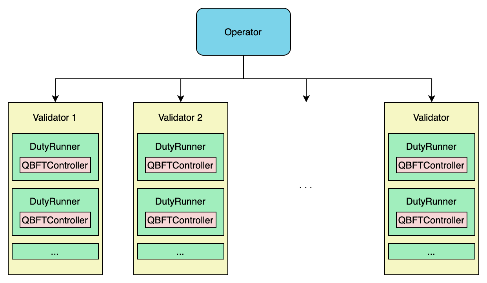
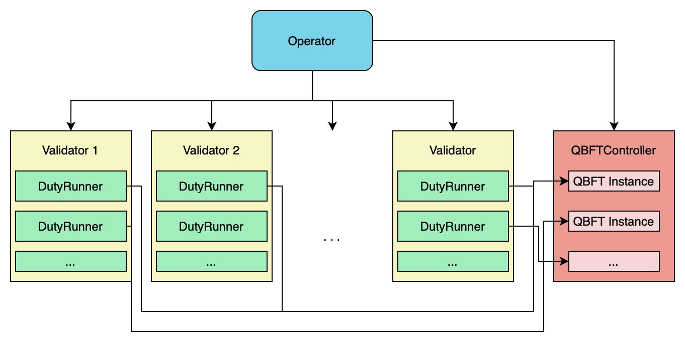
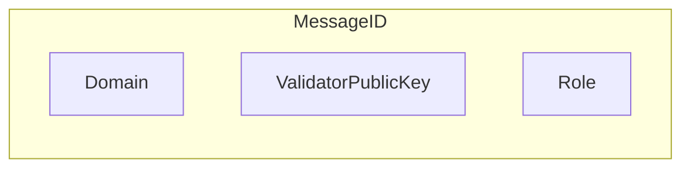
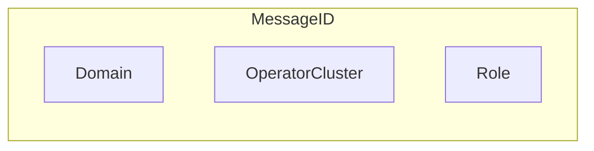

|     Author     |           Title            |  Category  |       Status        |    Date    |
| -------------- | -------------------------- | ---------- | ------------------- | ---------- |
| Matheus Franco | Cluster consensus          | Core       | open-for-discussion | 2024-03-05 |

## Summary

Aggregate `Attestation` and `Sync Committee` duties based on the cluster of operators and the duties' slot. Also, merge the post-consensus partial signature messages for such duties into a single message.

## Motivation

With the current design, a cluster of operators associated with several validators may end up performing more than one attestation or sync committee duties on equivalent data.

## Rationale

The aggregation of duties is possible because the data that must be agreed on is independent of the validator.

For example, take a look at the `AttestationData` type.
```go
type AttestationData struct {
	Slot            Slot
	Index           CommitteeIndex
	BeaconBlockRoot Root `ssz-size:"32"`
	Source          *Checkpoint
	Target          *Checkpoint
}
```
The only validator-dependent field is `CommitteeIndex` and it does not have to be agreed on.

For the `Sync Committee` duty, operators agree on a `phase0.Root` data which is also independent of the validator.

On the other hand, a post-consensus phase is still required for each duty that was previously aggregated. Thus, the partial signatures for each validator must still be shared between parties. Better than sending a message for each eth duty, we recommend merging the post-consensus partial signatures into a single message.

## Improvement

This proposal helps to decrease the number of messages exchanged in the network and the processing cost.

According to Monte Carlo simulations using a dataset based on the Mainnet, this proposal reduces to $21.60$% the current number of messages exchanged in the network. Note that this result includes aggregating the post-consensus messages into a single message.

Regarding the number of bits exchanged, we estimate that this proposal will reduce the current value to, at least, $52.96$%. Notice that this reduction is not as significant as the number of messages reduction due to the larger post-consensus messages.

Again with Monte Carlo simulations using the Mainnet dataset, the number of attestation duties aggregated presented the following distribution (notice that it also represents the number of partial signature messages merged into a single message).

<p align="center">

</p>

## Spec changes

### Design

Currently, an operator manages many `Validator` objects. Each has a `DutyRunner` for a duty type, each with its own `QBFTController` with its unique ID (that is also inserted in its associated messages).

<p align="center">

</p>

For the proposed change to take place, different `Validator` objects should use the same `QBFT Instance`. For that, we propose decoupling the `QBFTController` object from the `DutyRunner`.

<p align="center">

</p>

### New IDs

Since a single `QBFT instance` will be responsible for several validator duties, its ID must not be dependent on a validator key but rather on a cluster of operators. For that, we propose changing the `MessageID` from



to




### QBFT Controller

The current `QBFTController` structure allows only one consensus instance at a time. This must change, extending the `QBFTController` into a router of messages for the different instances.

### DutyRunner & QBFT Controller

Since the `DutyRunner` will not have its specific `QBFTController`, it must have a way to start a consensus instance and receive its decided value. For that, we propose applying the observer design pattern by which the `DutyRunner` (observer) can be updated upon a `QBFT Instance` (observable) termination.

We suggest that the `DutyRunner` holds a reference to the operator's `QBFTController` to start a `QBFT Instance` and observe it.

```go
func (r *DutyRunner) execute() {
	r.QBFTController.StartConsensus(r.committee, r.duty, r)
}

func (c *QBFTController) StartConsensus(committee []types.Operator, duty types.Duty, observer Observer) {
	if !c.HasConsensus(committee, duty) {
		instance := c.StartInstance(committee, duty)
	}
	instance.registerObserver(observer)
}
```

### Partial Signature Message

The `SignedPartialSignatureMessage` may be left untouched.

```go
type SignedPartialSignatureMessage struct {
	Message   PartialSignatureMessages
	Signature Signature `ssz-size:"96"`
	Signer    OperatorID
}
```

While the `PartialSignatureMessages` and `PartialSignatureMessage` types could change as follows:

```go
type PartialSignatureMessages struct {
	Slot     phase0.Slot
	Messages []*PartialSignatureMessage `ssz-max:"?"` // To be defined
}
type PartialSignatureMessage struct {
	PartialSignature Signature `ssz-size:"96"` // The Beacon chain partial Signature for a duty
	SigningRoot      [32]byte  `ssz-size:"32"` // the root signed in PartialSignature
	Signer           OperatorID
	ValidatorIndex 	 ValidatorIndex
	Type     		 PartialSigMsgType
}
```

The `PartialSignatureMessages` structure would drop the `Type` attribute since signatures for the sync committee and attestation duties could be contained in the same message. The `PartialSignatureMessage` would add attributes for the duty's validator and its type.

### Consensus Message Validation

**How to sign the messages now?**

Currently, to sign consensus messages, operators use their shared BLS key of the duty's validator. With this change, multiple validators are associated with a consensus execution. How to choose a BLS key? At least, it would need some agreed-upon deterministic selection function. This isn't so straightforward with this design because the consensus and duty execution logics are decoupled and there's no module in the spec code that handles data with a complete list of duties to be executed for the next slot. In the proposed design, different validators can trigger and observe a consensus execution in some random order, and the consensus module can not know how many validators are yet to come and subscribe (so it can't compute the selected key).

The bright side is that there's a cryptography change being developed for operators to start using their network keys when signing consensus messages. This would make this problem much simpler and, therefore, we make this change as a pre-requisite for this SIP.

## Drawbacks

- Several duties will depend on the same consensus execution. Thus, its failure will imply many attestation misses. Nonetheless, this will also make the operator more scalable due to the overall reduction in exchanged messages and processing costs.

## Extra improvements

- If multiple partial signatures contained in a merged message refer to the same root (i.e. validators in the same Ethereum committee), the signatures can be verified using batch verification.

## Message Validation

This duties transformation requires similar changes in message validation, namely:
- Different consensus executions are tagged by the `MessageID`. This change would be propagated with no further issues. However, the `MessageID` is used to get the validator's public key and the duty's role which are used as an ID to store the consensus state. This must be changed to use the operators' committee and the duty's role, or even simply the `MessageID`.
- Message validation limits the number of attestation duties per validator by using the validator's public key contained in the `MessageID`. This is no longer possible. A new limitation can be accomplished by checking the number of validators a cluster of operators is assigned to. If this number is less than 32 (the number of slots in an epoch), then we can limit the number of attestation duties of such cluster per epoch. The only exception would be if such a cluster is assigned to a sync committee duty (considering that we will indeed merge attestations and sync committee duties altogether in the same consensus execution).

## Pre-requisites

- A cryptography change that makes operators use their network keys to sign consensus messages.

## Open questions

- What should be the maximum number of signatures a post-consensus message can contain? The trade-off here refers to reducing the number of exchanged messages versus reducing the impact of a DoS buffer attack attempt.
- Though the number of consensus instances could be reduced to 1 (per unique operators cluster), the number of post-consensus phases is still defined by the number of validators. It remains open if it's possible to share partial signatures and re-construct all validator signatures in constant time per unique clusters.
