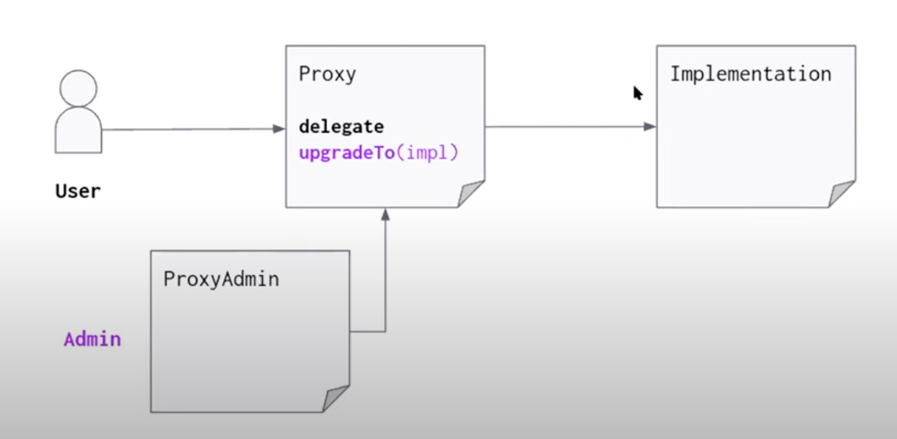
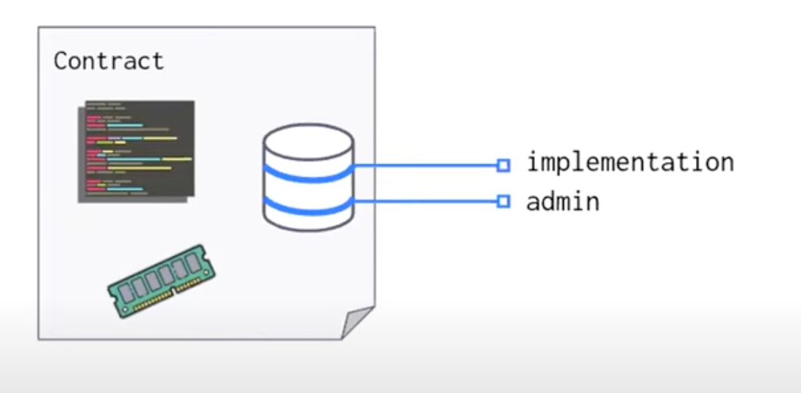
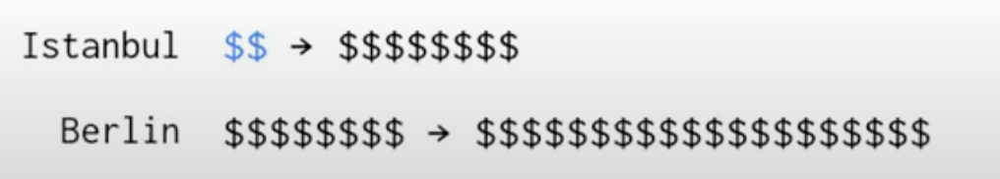
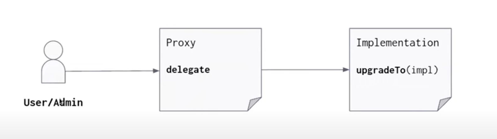
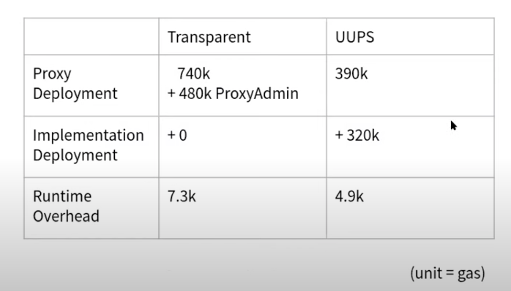

| Author        | Title                                       | Category | Status |
|---------------|---------------------------------------------|----------|--------|
| Wadym Chumak  | Universal upgradeable proxy standard (UUPS) | Core     | open-for-discussion  |

**Summary**
Describes Universal Upgradeable Proxy Standard (UUPS) [EIP-1822](https://eips.ethereum.org/EIPS/eip-1822) in comparison to Transparent Upgradeable Proxy.

**Rational & Design Goals**  
This SIP does not change the SSVRegistry and SSVNetwork implementation logic but rather the way to optimize the gas usage on User-Proxy level.

**Specification**

**Transparent Proxy**  
To fully understand why UUPS is meaningful, you need to know how Transparent Proxy works.



***What is the issue with this?***

The admin just as the implementation is going to be kept in the storage of the proxy. 



And the problem with this is that storage is actually one of the most expensive thing that you can do in a contract. Running code, accessing and writing to memory relativy cheap.

Every time when a user calls into the proxy you need to check, - is this caller admin or not. So need to fetch admin from a storage incurring the cost of that storage access, compare it and most likely it's not going to be the admin and so you fetch the implementation and do delegation. So it's two storage accesses there.



At very beginning when proxy pannel was released, that wasn't that much of  a problem. Storage wasn't really that expensive. But through the subscequent network upgrades has become more and more expensive.


**Universal Upgradeable Proxy Standard (UUPS)**  


Shortly, everything that goes through the proxy just get delegated as is over  to the Implementation. So we no longer have this overhead of having to fetch the admin on every call.

***Drawbacks?***
- complexity in implementation
- upgradeTo function need to be included in every upgrade Implementation version. If you forget to include it in new version, the contract will lose opportunity to be upgradable anymore.


**Cost Comparison (Transparent vs UUPS)**

On a user-proxy level, based by OZ team tests results:


Our internal SSVNetwork and SSVRegistry tests results:


**Deployment changes**

One of the challenges is to deploy UUPS contract. [hardhat-deploy](https://github.com/wighawag/hardhat-deploy) doesn't not support it. There is only one way, which was used before we switched to hardhat-deploy: manual deployment scripts (hardhat-ugpgrades). Or to use some tricks to include hardhat-upgrades mechanism inside hardhat-deploy.

**Implementation**

To make implementation contract UUPS compliant need to inherit a common standard interface that requires one to include the upgrade logic, like inheriting OpenZeppelin's [UUPSUpgradeable](https://docs.openzeppelin.com/contracts/4.x/api/proxy#UUPSUpgradeable1) interface.

```go
contract Box is UUPSUpgradeable {
    uint256 private _value;

    function store(uint256 value) public { /*..*/ }

    function retrieve() public view returns (uint256) { /*..*/ }

     // Upgrade logic in Implementation contract
     upgradeTo(address newImpl) external {
         // Changes stored address of implementation of contract
         // at its slot in storage
     }
}

contract BoxProxy {

     function _delegate(address implementation) internal virtual { /*..*/ }

     function getImplementationAddress() public view returns (address) { /*..*/ }

     fallback() external { /*..*/ }
}
```