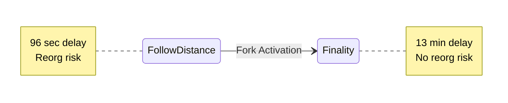
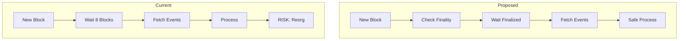

| Author | Title                        | Category | Status              | Date       |
|--------|------------------------------|----------|---------------------|------------|
| xxx    | Finality-Based Event Syncing | Core     | open-for-discussion | 2025-05-27 |

## Summary

This SIP proposes transitioning from the current `follow-distance` approach to a `finality-based` approach for syncing
Ethereum events. After a configurable fork epoch, SSV nodes will process events only from blocks confirmed as
`finalized`
by the consensus layer. This transition will provide stronger cryptographic guarantees against most chain
reorganizations, significantly enhancing the reliability of event processing while maintaining a clear path for backward
compatibility during the upgrade.

## Motivation

The current event syncing mechanism has critical issues:

1. **Vulnerability to Reorganizations**: Relying on non-finalized blocks (which are inherently less reliable until
   finality) exposes the system to potential state inconsistencies if processed blocks are later reorged out.
2. **False Sync Failures**: The system can incorrectly assume a sync failure and crash when detecting old execution
   layer block times, even when this is due to the beacon chain simply not proposing new blocks (e.g., due to network
   stalls or low participation).

These issues compromise SSV's reliability and can cause state divergence between operators.

## Rationale

### Current State: Follow Distance

- Processes blocks N blocks behind head (default: 8)
- Assumes probabilistic finality
- Vulnerable to deep reorganizations

### Proposed: Finality-Based Syncing

- Uses Ethereum's finalized blocks
- Significantly reduces reorganization risks by relying on cryptographically finalized blocks
- Aligns with Ethereum's security model

## Specification

### Behavioral Changes

This change will be activated as part of a network-wide fork. The specific fork mechanism and activation epochs will be
defined separately as part of the broader network upgrade.

**Pre-Fork (Alan)**:

- Continue using the existing follow-distance mechanism (N blocks behind head, default N=8)
- Process events from blocks assumed to be probabilistically final
- Existing behavior remains unchanged

**Post-Fork (FinalityConsensus)**:

- Query finalized blocks directly from the execution layer client using calls `eth_getBlockByNumber("finalized")`
- Process SSV contract events exclusively from these finalized blocks.
- The staleness threshold for determining if the node is lagging behind the chain will need adjustment. For example,
  instead of a fixed time (e.g., 5 minutes), it could be based on the number of epochs behind the current finalized
  epoch. A proposed value for this, **open for discussion,** is approximately 2-3 epochs.

### Key Implementation Points

1. **One-way Transition**: Once the fork activates, nodes will exclusively use finality-based syncing with no fallback.
2. **Automatic Detection**: Nodes will detect fork activation and transition automatically.
3. **Health Monitoring**: Health monitoring and sync status metrics will be adapted to reflect the new finality-driven
   approach. The acceptable lag behind the finalized head of the chain before considering the node unhealthy or out of
   sync will be based on epochs (e.g., the **proposed and discussable** 2-3 epochs) rather than solely on block time.

## Visual Overview

The following diagrams illustrate the key concepts of this proposal.

### 1. Fork State Transition Diagram

The one-way transition from PreFork (follow-distance) mode to PostFork (finality) mode based on the beacon chain epoch.

### 2. Event Processing Flow Comparison

The event processing flow before and after the fork.

### 3. Event Processing Timeline Comparison

The difference in event processing latency between the pre-fork and post-fork mechanisms.

```mermaid
gantt
    title Event Processing Timeline
    dateFormat X
    axisFormat %s

    section PreFork
        Block Produced: done, pre1, 0, 12
        Follow Distance Wait: active, pre2, 12, 96
        Process Events: crit, pre3, 96, 10

    section PostFork
        Block Produced: done, post1, 0, 12
        Wait for Finality: active, post2, 12, 768
        Process Events: crit, post3, 768, 10
```

## Performance Impact

- **Event Lag**: The time between an event occurring on-chain and it being processed by the SSV node will likely
  increase. Using the current follow distance (e.g., 8 blocks * ~12s/block ≈ 1.6 minutes) versus waiting for finality (
  typically 2 epochs, so ~12.8 minutes) represents a significant change. This is a crucial tradeoff: longer lag for
  guaranteed event stability.

## Backwards Compatibility

- Nodes that are not upgraded before the "FinalityConsensus" fork activation epoch will continue to use the
  follow-distance mechanism.
- Such non-upgraded nodes risk processing events from blocks that are subsequently reorganized and not part of the
  finalized chain, leading to potential state divergence from upgraded nodes, especially in edge cases involving chain
  instability.

## Security Considerations

- **Enhanced Security**: Transitioning to cryptographic finality for event processing inherently strengthens the node
  against state corruption or inconsistencies caused by execution layer reorganizations.
- **Trust Model**: Reliance shifts more explicitly towards the finality guarantees provided by Ethereum's consensus
  layer, which is a core security assumption of the PoS network.
- **Attack Surface**: This change is expected to reduce the attack surface related to manipulating node state through EL
  reorgs.

## Test Scenarios

1. Verification of smooth fork transition during active syncing and under various network conditions.
2. Node behavior when finalized blocks are temporarily unavailable or significantly delayed from the consensus layer.
3. Performance analysis of event processing lag under normal and stressed network conditions post-fork.
4. Monitoring and alerting functionality for the new finality-based sync status.

## Migration Guide

1. **Pre-Fork**: Node operators must update their SSV node software to a version supporting the "FinalityConsensus" fork
   well in advance of the announced activation epoch for their respective network. Monitor official announcements for
   activation epoch details.
2. **During Fork Activation**: The transition should be automatic once the node's current epoch reaches the "
   FinalityConsensus" activation epoch. Operators should monitor node logs for confirmation of the new operational mode.
3. **Post-Fork**: Verify that the node is processing events based on finalized blocks. Adjust any external monitoring or
   alerting systems to align with the new finality-based health metrics and expected event lag.

## Open Questions

- The exact activation epoch for the "FinalityConsensus" fork needs to be determined.
- What are the optimal and commonly agreed-upon thresholds for health monitoring regarding lag behind the finalized
  epoch (currently **proposed for discussion at 2-3 epochs**)?
