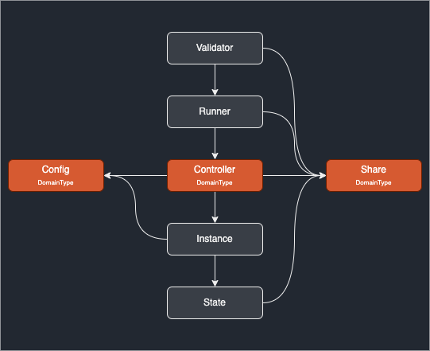

| Author      | Title        | Category | Status |
|-------------|--------------|----------|--------|
| Alon Muroch & Matheus Franco | Fork Support | Core     | approved  |

**Summary**  
Describes how to support forks in the SSV network.
A fork is a non backwards compatible change to the protocol, i.e., change message structs/ types/ functionality.

Forks are a bit tricky in SSV as there are multiple QBFT instances running with no way of knowing when each ends.  
For a forks to work they need a clear trigger.

**Triggering**  
A fork will be triggered by a beacon epoch number as its deterministic and easy to compute independently. If epoch E is the trigger epoch then pre-fork are all messages refering epoch < E and post-fork are all messages referring epoch >= E.

**Transition**  
Once Epoch E starts, the runner and QBFT controller change domain type from T to T' (the new fork domain). 

Client implementation should calculate when a new duty starts to decide if it starts with T or T', transition during duty execution is impossible. 

**History Sync**  
Sycing messages from a peer stays unchanged as messages have the identifier in them with domain type 


## Current State

Currently, there's **no fork change logic**. However, there's **network and fork identification** through the `DomainType`. For instance, we have
```go
type DomainType [4]byte
var (
	GenesisMainnet = DomainType{0x0, 0x0, 0x0, 0x0}
	PrimusTestnet  = DomainType{0x0, 0x0, 0x1, 0x0}
	ShifuTestnet   = DomainType{0x0, 0x0, 0x2, 0x0}
	ShifuV2Testnet = DomainType{0x0, 0x0, 0x2, 0x1}
	V3Testnet      = DomainType{0x0, 0x0, 0x3, 0x1}
)
```
The _DomainType_ major importance is the fact that **it's mixed in the signature** such that messages on different domains will have different signatures.

The node takes one of the above _DomainType_ values and **holds it until termination**.

In the _DomainType_, the third byte corresponds to the **network** (Mainnet, Primus, etc.), and the fourth byte corresponds to the **fork or protocol version** for this network.

In the actual implementation, _DomainType_ appears in the following structures:
- `Share`
- `Config`
- `Controller`

Below, you can see how **DomainType** is linked with the main structures.

<p align="center">

</p>

### Use cases

- When an _Instance_ needs to verify a signature. For example
```go
signedMessage.Signature.VerifyByOperators(signedMessage, config.GetSignatureDomainType(), types.QBFTSignatureType, operators);
```


- Each _Runner_, by creating the message ID when it needs to create a message. For example
```go
msgToBroadcast := &types.SSVMessage{
		MsgType: types.SSVPartialSignatureMsgType,
		MsgID:   types.NewMsgID(r.GetShare().DomainType, r.GetShare().ValidatorPubKey, r.BaseRunner.BeaconRoleType),
		Data:    data,
	}
```

- When the _BaseRunner_ validates a partial signature. For instance
```go
func (b *BaseRunner) validatePartialSigMsgForSlot(...) {
	...
	signedMsg.GetSignature().VerifyByOperators(signedMsg, b.Share.DomainType, types.PartialSignatureType, b.Share.Committee)
	...
}
```

- Indirect usage: an _Instance_ includes its _State.ID_ in messages. The _State.ID_ is initialized as the controller's _Identifier_ which contains the _DomainType_. The controller's identifier is fixed. It's used as:
  - an argument on instance creation.
  - to broadcast decided messages.
  - in base validation, to verify if the message was sent to the correct controller.


## Proposed Changes

Along with the `DomainType`, we include a `NetworkID` type and a new `ForkData` structure.


```go
// NetworkID are intended to separate different SSV networks. A network can have many forks in it.
type NetworkID byte

const (
	MainnetNetworkID = NetworkID(0x0)
	PrimusNetworkID  = NetworkID(0x1)
	ShifuNetworkID   = NetworkID(0x2)
	JatoNetworkID    = NetworkID(0x3)
	JatoV2NetworkID    = NetworkID(0x4)
)

// DomainType is a unique identifier for signatures, 2 identical pieces of data signed with different domains will result in different sigs
type DomainType [4]byte

// DomainTypes represent specific forks for specific chains, messages are signed with the domain type making 2 messages from different domains incompatible
var (
	GenesisMainnet = DomainType{0x0, 0x0, byte(MainnetNetworkID), 0x0}
	PrimusTestnet  = DomainType{0x0, 0x0, byte(PrimusNetworkID), 0x0}
	ShifuTestnet   = DomainType{0x0, 0x0, byte(ShifuNetworkID), 0x0}
	ShifuV2Testnet = DomainType{0x0, 0x0, byte(ShifuNetworkID), 0x1}
	JatoTestnet    = DomainType{0x0, 0x0, byte(JatoNetworkID), 0x0}
	JatoV2Testnet  = DomainType{0x0, 0x0, byte(JatoV2NetworkID), 0x1}
)

// ForkData is a simple structure holding fork information for a specific chain (and its fork)
type ForkData struct {
	// Epoch in which the fork happened
	Epoch phase0.Epoch
	// Domain for the new fork
	Domain DomainType
}

func (domainType DomainType) GetNetworkID() NetworkID {
	return NetworkID(domainType[2])
}

func (networkID NetworkID) GetForksData() []*ForkData {
	switch networkID {
	case MainnetNetworkID:
		return mainnetForks()
	case JatoNetworkID:
		return []*ForkData{{Epoch: 0, Domain: JatoTestnet}}
	case JatoV2NetworkID:
		return []*ForkData{{Epoch: 0, Domain: JatoV2Testnet}}
	default:
		return []*ForkData{}
	}
}

// mainnetForks returns all forks for the mainnet chain
func mainnetForks() []*ForkData {
	return []*ForkData{
		{
			Epoch:  0,
			Domain: GenesisMainnet,
		},
	}
}

func (networkID NetworkID) DefaultFork() *ForkData {
	return networkID.GetForksData()[0]
}

// GetCurrentFork returns the ForkData with highest Epoch smaller or equal to "epoch"
func (networkID NetworkID) ForkAtEpoch(epoch phase0.Epoch) (*ForkData, error) {
	// Get list of forks
	forks := networkID.GetForksData()

	// If empty, raise error
	if len(forks) == 0 {
		return nil, errors.New("GetCurrentFork: fork list by GetForksData is empty. Unknown Network")
	}

	var current_fork *ForkData
	for _, fork := range forks {
		if fork.Epoch <= epoch {
			current_fork = fork
		}
	}
	return current_fork, nil
}

func (f ForkData) GetRoot() ([]byte, error) {
	byts, err := json.Marshal(f)
	if err != nil {
		return nil, errors.Wrap(err, "could not marshal ForkData")
	}
	ret := sha256.Sum256(byts)
	return ret[:], nil
}
```

### Structures access to types

- `Share`: It's more appropriate for the structure to hold the information on the network that it's in, instead of the domain type.
    Thus, _Share_ will contain a `NetworkID` field instead of a `DomainType` field.

Regarding the indirect usage of Identifiers:
- `Instance`:
  - Must keep its identifier to send properly formed messages.
- `Controller`:
  - Should replace its _Identifier_ with an _IdentifierF_ getter function, passed by the Runner. With the function instead of the fixed value, it can compute the up-to-date identifier when needed.
  - Since the controller's `config` must also be updated, the controller should also contain a _DomainTypeF_ function, instead of its fixed _DomainType_ field.

```go

type IdentifierF func() []byte // <-- new func type
type DomainTypeF func() (types.DomainType,error) // <-- new func type

type Controller struct {
	IdentifierF IdentifierF // <-- replace Identifier []byte to Identifier getter function
	Height     Height 
	StoredInstances InstanceContainer
	FutureMsgsContainer map[types.OperatorID]Height
	DomainTypeF         (types.DomainType,error) // <-- replace Domain types.DomainType to DomainType getter function
	Share               *types.Share
	config              IConfig
}

func (c *Controller) StartNewInstance(height Height, value []byte) error {
	// ...

	domainType, err := c.DomainTypeF()
	if err != nil {
		return Errors.Wrap(err,"Coudld not get current DomainType.")
	}
	c.config.SetSignatureDomainType(domainType) // <-- updates its config using its new DomainF
    	
	c.Height = height
	
	newInstance := c.addAndStoreNewInstance()
	
	newInstance.Start(value, height)

	c.forceStopAllInstanceExceptCurrent()

	return nil
}

func (c *Controller) addAndStoreNewInstance() *Instance {
	i := NewInstance(c.GetConfig(), c.Share, c.IdentifierF(), c.Height) // <-- set instance's identifier as new up to date identifier

	c.StoredInstances.addNewInstance(i)
	
	return i
}

```

An example of how the required functions for the new controller can be computed using the `BaseRunner` is shown below.

```go
type BaseRunner struct {
	State          *State
	Share          *types.Share
	QBFTController *qbft.Controller
	BeaconNetwork  types.BeaconNetwork
	BeaconRoleType types.BeaconRole
	highestDecidedSlot spec.Slot
}

func (b *BaseRunner) GetIdentifierF() func() []byte {
	return func() []byte {
		currentEpoch := b.BeaconNetwork.EstimatedCurrentEpoch()
		domainType := b.Share.NetworkID.ForkAtEpoch(currentEpoch)
		identifier := types.NewMsgID(domainType,b.Share.ValidatorPubKey[:],b.BeaconRoleType)
		return identifier[:]
	}
}

func (b *BaseRunner) GetDomainTypeF() func() (types.DomainType, error) {
	return func() (types.DomainType, error) {
		currentEpoch := b.BeaconNetwork.EstimatedCurrentEpoch()
		fork, err := b.Share.NetworkID.ForkAtEpoch(currentEpoch)
		if err != nil {
			return nil, err
		}
		return fork.Domain, nil
	}
}
```
