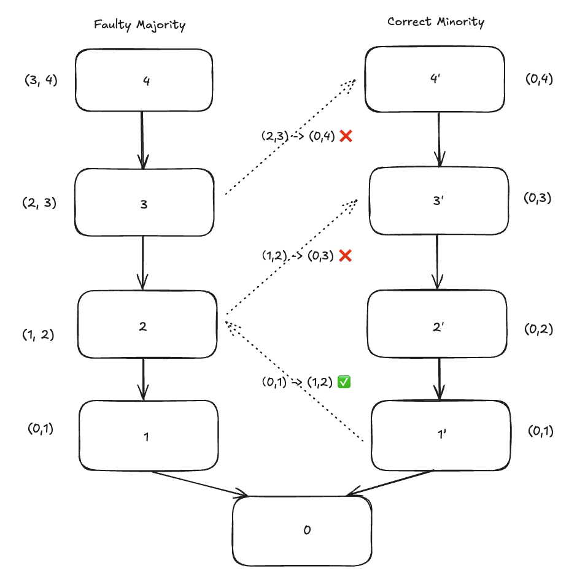

|     Author     |           Title           | Category |       Status        |    Date    |
| -------------- | ------------------------- | -------- | ------------------- | ---------- |
| Alan Li        | Majority Fork Protection | Core     | open-for-discussion  | 2025-07-08 |

## Summary
This SIP addresses a slashing risk in SSV Network DVT that arises during client majority forks, as observed in the Holesky testnet [incident](https://etherworld.co/2025/02/24/holesky-testnet-incident-postmortem-report/) after the Pectra upgrade. When a majority execution client (e.g., Geth) develops a bug and forks from the canonical chain, DVT validators can be pulled onto the faulty fork, risking slashing if they attempt to return to the correct chain. This SIP proposes a validation-based solution to improve validator safety by ensuring that only attestations matching an operator's own view are signed.

## Rationale & Design Goals
In Ethereum, consensus relies on validators attesting to blocks according to justified checkpoints. When an execution client develops a bug that causes it to fork from the canonical chain, validators using that client may unknowingly attest to an invalid chain.

Consider 1 majority client and 3 minority clients:
- **Majority**: Geth (produces an invalid block due to a bug)
- **Minority 1**: Besu
- **Minority 2**: Erigon
- **Minority 3**: Nethermind

In a **solo validator** setup, if the validator's client is Geth, it goes onto the faulty fork. But if the validator is using Besu or Erigon or Nethermind client, it remains safe.

In contrast, in an **SSV DVT setup**, the validator relies on a committee of multiple operators, each running potentially different clients. If even one operator runs a faulty client, the validator can be pulled onto the faulty fork. When the validator tries to switch away from the faulty chain it risks slashing as we will see below.

### DVT Example with 1-out-of-4 Majority Client


*A fork with faulty majority on the left side and correct minority on the right side. The numbers denote the epochs. (0,1) represents an attestation with source epoch 0 and target epoch 1. Dotted arrows between the chains represent proposals of new attestation data when advancing epochs in the DVT setting.*

#### The global view
Let's say at epoch 1 faulty majority creates an incorrect block, here a fork is created. At this point, the attestation sources and targets for both sides are still the same. 

Starting from epoch 2, the attestations are different. The majority client attests (1,2) because on this side 0 is finalized and 1 is justified as they are the majority. The minority clients attest (0,2) because 1' is not justified as they are the minority.

Similarly, in the following epoch we have (2,3) for the majority and (0,3) for the minority, and so on.

#### The DVT view
Still consider a DVT validator with 4 operators running 4 different clients, 1 faulty majority and 3 correct minorities.

At epoch 1 a DVT validator attests (0,1) in all circumstances. 

Starting from epoch 2 it depends on who is the attestation proposer of the epoch. 

- **If majority leads**, the attestation proposal is (1,2). 
    - Minority clients agree because signing (1,2) is not slashable given (0,1) was signed. 
    - Because the minority-proposed attestation (0,3) is now slashable due to the surrounding rule (having already signed (1,2)), the validator cannot safely return to the minority chain.
- **If minority leads**, the attestation proposal is (0,2). 
    - The majority client agree because signing (0,2) given (0,1) was signed is not slashable. 
    - However, in the following epoch, proposals from the faulty majority can be signed because signing (2,3) given (0,2) was signed is not slashable.

To conclude, if the majority is signed there is no way back to minority. Also because the majority client operator will eventually propose attestation due to the round-robin proposer selection mechanism, the validator will eventually only sign faulty majority attestation, even though there are 3 correct minority operators.

### Design Goals
The goal is to enhance validator safety and network resilience by preventing DVT validators from being slashed due to majority client bugs. The design aims to:
- Ensure DVT validators only sign attestations with source and target epochs agreed upon by a quorum of operators.
- Maintain compatibility with asynchronized clients without introducing unnecessary complexity.

Concretely, the majority fork protection mechanism guarantees that a DVT validator only signs attestations with source and target epochs agreed by a quorum of operators.

Consider a DVT validator with $n=3f+1$ operators, where $f$ is the maximum number of Byzantine fault operators it can tolerate. Each of these $n$ operators can have different target and source epochs, due to forking or asynchronization. The properties we get based on our attestation validation mechanism are:

1. Only with at least $2f+1$ operators sharing the same source and target epochs, attestations will be signed.
2. When no quorum, no attestations will be signed.


## Specification
The proposed solution is to simply add a validation rule before signing attestation. A client needs to get its attestation data from the beacon. Then the client only signs a proposed attestation if the source and target match its own attestation data. 

```go
func shouldSignAttestation(own, proposed Attestation) bool {
    return own.Source == proposed.Source && own.Target == proposed.Target
}
```