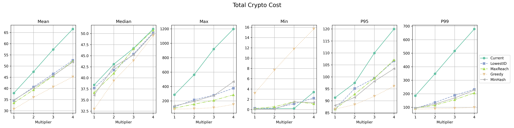

|     Author     				  |           Title            |  Category  |       Status        |    Date    |
| --------------------------------| -------------------------- | ---------- | ------------------- | ---------- |
| @diegomrsantos, Matheus Franco  | Network Topics MinHash     | Network    | open-for-discussion | 2024-03-06 |

## Table of Contents <!-- omit from toc -->
- [Summary](#summary)
- [Motivation](#motivation)
- [Rationale](#rationale)
- [Spec Change](#spec-change)
- [Fork Transition](#fork-transition)
	- [Before the Fork](#before-the-fork)
	- [At and After the Fork](#at-and-after-the-fork)
- [Topic Names](#topic-names)
- [Appendix](#appendix)
	- [Alternative Solutions](#alternative-solutions)
		- [1. Greedy Algorithm](#1-greedy-algorithm)
		- [2. MaxReach](#2-maxreach)
		- [3. LowestID](#3-lowestid)
		- [Comparisons](#comparisons)


## Summary

This SIP proposes to use [MinHash](https://www.cs.princeton.edu/courses/archive/spring13/cos598C/broder97resemblance.pdf) for assigning committees to topics, aiming to reduce the number of irrelevant (non-committee) messages operators must process.

## Motivation

Currently, the committee-to-topic assignment is pseudo-random, using a hash of all committee operators combined modulo 128 (number of topics):

```go
// Bytes -> Int -> Modulo 128
func CommitteeSubnet(cid spectypes.CommitteeID) uint64 {
	subnet := new(big.Int).Mod(new(big.Int).SetBytes(cid[:]), bigIntSubnetsCount)
	return subnet.Uint64()
}

// Operators -> Bytes -> Hash
func GetCommitteeID(committee []OperatorID) CommitteeID {
	// sort
	sort.Slice(committee, func(i, j int) bool {
		return committee[i] < committee[j]
	})
	// Convert to bytes
	bytes := make([]byte, len(committee)*4)
	for i, v := range committee {
		binary.LittleEndian.PutUint32(bytes[i*4:], uint32(v))
	}
	// Hash
	return sha256.Sum256(bytes)
}
```

This randomness forces operators active in many committees to listen to multiple topics and process many irrelevant messages, which limits scalability. 

## Rationale

In contrast, MinHash assigns committees to topics based on the minimum hash of each committee operator.
This increases the probability of committees being assigned to the same topic when they have most of their operators in common.
The matching mainly occurs if one of the common operators holds the minimum hash of both sets, approximating the Jaccard similarity

$$P(min(\pi(A)) = min(\pi(B))) = \frac{|A \cap B|}{|A \cup B|} = J(A,B)$$

where $\pi$ is the permutation associated with the hash function.

Concretely, consider two committees $C_1$ and $C_2$ of equal size $k$ that differ by one operator.
They may be assigned to the same topic either if their minimum hash is equal or if the different minimum hashes end up in the same topic:
$$P(t(C_1) = t(C_2)) = J(C_1,C_2) + (1-J(C_1,C_2))\times \frac{1}{128}$$

| Committee Size ($k$) | Probability ($P(t(C_1) = t(C_2))$) |
|:---------------------|:-----------------------------------|
| 4                    | 60.31%                             |
| 7                    | 75.20%                             |
| 10                   | 81.96%                             |
| 13                   | 85.82%                             |

> [!NOTE]
> Alternative [Locality Sensitive Hashing (LSH)](https://en.wikipedia.org/wiki/Locality-sensitive_hashing) functions were tested but proved unsuitable for our context:
> - **SimHash (Charikar's Hash)**:
> While SimHash theoretically approximates Cosine Similarity,
> which offers a higher collision probability than MinHash (e.g. ~77% vs. 60% for 4-element sets),
> it failed in practice because it produces a "fingerprint" for the entire set rather than selecting a common element in a small discrete set.
> Even though similar committees produce similar fingerprints, a single bit difference, caused by changing one operator, results in a completely different integer value
> (and thus resulting topic).
> - **Consensus MinHash (Voting) and Multi-Hash Minimum**: We attempted to boost stability by (i) computing k independent MinHashes and taking a majority vote,
> and (ii) by taking the global minimum of the $k$ hashes. 
> However, this offered no improvement and only incurred more computation overhead.

## Spec Change
For each committee, we assign its topic in the following way:

```javascript
CONSTANTS:
NUM_TOPICS = 128
MAX_UINT256 = (2^256) - 1

FUNCTION AssignCommitteeToTopic(committee: list[uint64]):
	min_int = MAX_UINT256
	
	FOR each operator_id IN committee:
		# 1. Serialize the uint64 Operator ID to 8 bytes (Little-Endian)
		input_bytes = serialize_uint64_little_endian(operator_id)
		
		# 2. Compute the SHA-256 hash, resulting in 32 bytes
		hash_bytes = SHA256(input_bytes)
		
		# 3. Convert to uint256 (Big-Endian)
		current_int = uint256_from_bytes_big_endian(hash_bytes)
		
		# 4. Get minimum
		IF current_int < min_int:
			min_int = current_int
	
	# 5. Modulo for topic ID
	RETURN min_int MOD NUM_TOPICS
```

## Topic Names

Currently, prior to this change, topics were named by `ssv.v2.<subnet>` for `<subnet>` from 0 to 127.

On the Boole fork, which introduces this change, the new topics will be named by `/ssv/<ethereum_network_name>/boole/<subnet>`,
where `<subnet>` varies from 0 to 127 as usual, and `<ethereum_network_name>` is the name of the Ethereum network in lower-case, i.e. `mainnet`, `sepolia`, `holesky`, or `hoodi`.
For example, topic 0 for mainnet would be `/ssv/mainnet/boole/0`.

## Fork Transition

### Constants

| Name               | Value | Description                                                                                  |
|--------------------|-------|----------------------------------------------------------------------------------------------|
| PRIOR_WINDOW       |   1   | Number of epochs before the fork when operators MUST subscribe to both old and new topics.    |
| SUBSEQUENT_WINDOW  |   1   | Number of slots after the fork when operators MUST remain subscribed to old topics as well.   |

To enable a safe transition through the fork, the following policy MUST be followed. Define:
- $old$: the set of topics an operator SHOULD be subscribed to before the fork, based on committee assignments.
- $new$: the set of topics an operator SHOULD subscribe to after the fork, based on committee assignments.

### Message Validation

- The set of message validation rules in effect pre-fork is denoted `MVA`. The set of rules post-fork is denoted `MVB`.
- For any received message:
    - Let the associated Ethereum slot be derived from the message:
        - For consensus messages: use the `Height` field.
        - For partial signature messages: use the `Slot` field.
    - If the slot is prior to fork activation, nodes MUST apply `MVA`.
    - If the slot is at or after fork activation, nodes MUST apply `MVB`.
- Implementations MUST perform topic validation as follows:
    - If the referenced slot belongs to the Alan fork, the message topic MUST use the Alan topic naming.
    - If the referenced slot belongs to the Boole fork, the message topic MUST use the Boole topic naming.
    - If the topic does not match the expected topic for the derived slot, an ErrIncorrectTopic error MUST be returned.

### Before the Fork

- Operators MUST be subscribed to all $old$ topics, and MUST publish to them.
- In the `PRIOR_WINDOW` epochs prior to the fork, an operator MUST subscribe to all topics in $new \cup old$.
- In this window, for each topic in $new \setminus old$:
    - The operator SHOULD warm up the mesh by setting up GRAFT connections.
    - No messages are expected on these brand-new topics before the fork.
- `PRIOR_WINDOW` SHOULD be set to a value (RECOMMENDED: 1 epoch) sufficient to prepare the mesh for all new topics, but short enough to avoid long periods of extra resource usage. 

> [!NOTE]
> If, during the `PRIOR_WINDOW`, an operator is assigned to new topics (for example, due to joining new committees), the following rules MUST apply:
> - Before the fork, the operator MUST be subscribed to both the pre-fork and post-fork topics.
> - After the fork, the operator MUST unsubscribe from pre-fork topics and MUST remain only in post-fork topics.

### At and After the Fork

- For the duration of `SUBSEQUENT_WINDOW` (RECOMMENDED: 1 Ethereum slot) after activation, nodes MUST remain subscribed to $old$ topics in addition to $new$ topics.
- For every received message, nodes MUST determine the effective fork from the message's slot, and MUST validate the message according to that fork’s rules. The received topic name MUST only be used as a consistency check.
- After `SUBSEQUENT_WINDOW` has elapsed, nodes MAY unsubscribe from $old$ topics. Any subsequently received messages on old topics MAY be dropped, even if the slot would otherwise be valid.
- Note: Since `SUBSEQUENT_WINDOW` is brief, some valid pre-fork messages MAY be lost; this is acceptable in order to conserve resources.


## Alternative Solutions

Other solutions were considered. We classify them through 3 properties:
- **Statefulness**: whether the current network state affects the assignment of committees.
- **Stability**: for stateful models, whether the assignment of new committees can change the assignment of existing committees.
- **History-dependence**: for stateful models, whether the assignment depends on the order of network events or only on the current state.

Even though some solutions provided better performance,
we selected MinHash due to its simplicity (stateless, as the current model) and good performance. 
We present the other solutions here just for historical purposes and future reference.

### 1. Greedy Algorithm

**Properties**: Stateful, stable, history-dependent.

**Rationale**: This stateful algorithm minimizes assignment cost using an objective function. Let:
- $v_c$ and $O_c$ be the number of validators and operators in committee $c$,
- $v_t$ and $O_t$ be the number of validators and operators in a topic $t$, respectively.

The cost of adding a committee to topic $t$ is given by:

$$Agg(c,t) = | O_c \setminus O_t | \times v_t + | O_t \setminus O_c | \times v_c$$

**Initialization**:
- Sort committees by validator count.
- Assign the largest 128 committees to the 128 topics.
- Insert remaining committees greedily into the topic minimizing the above cost function.

**Event Handling**:

- Adding a new committee: assign using insertion logic.
- Adding validators in existing committees: no topic change.
- Removing validators: no topic change, unless the committee is empty and, in that case, it's removed.

### 2. MaxReach

**Properties**: Stateful, unstable, history-independent.

**Rationale**: This stateful model tracks each operator’s participation count in active committees.
In order to combine well-connected committee groups, a committee is assigned to a topic based on the operator with the **highest reach** (most committees).
The operator’s ID is hashed and mapped modulo 128.

Note: It's unstable because adding a committee can change operator counts, affecting assignments of other committees. However, it shouldn't be very common.

### 3. LowestID

**Properties**: Stateless, (and thus) stable, history-independent.

**Rationale**: This stateless simplistic model assigns a committee to the topic corresponding to its operator with the lowest ID.
Any improvement from it comes purely from committee formation patterns, while no robustness is provided.

### Comparisons

<p align="center">

</p>

The plot above shows a comparison among the current solution, the MinHash algorithm, and the alternative solutions.
The MinHash algorithm is chosen based on the considerations of both performance and simplicity (being stateless).

