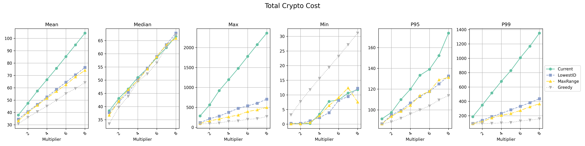
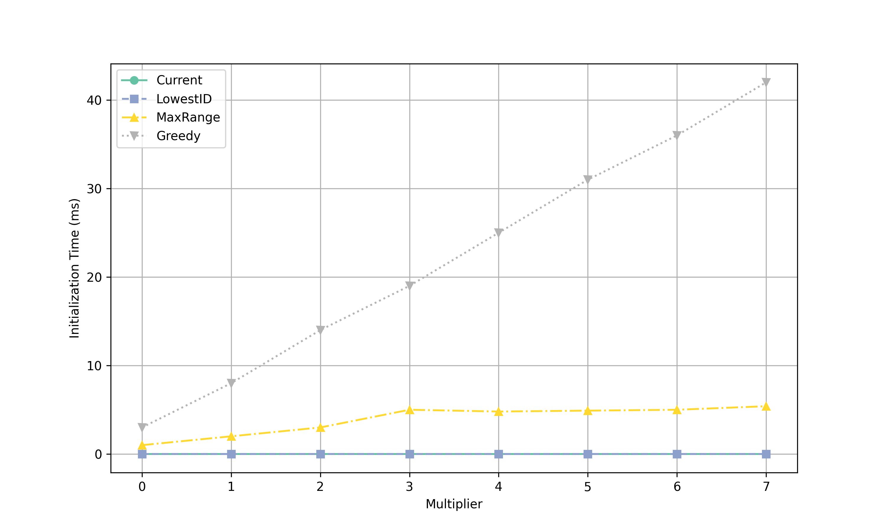
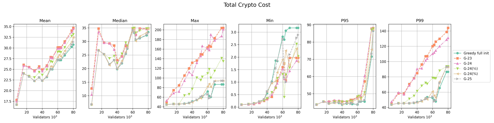
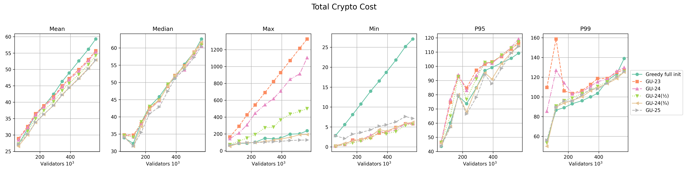
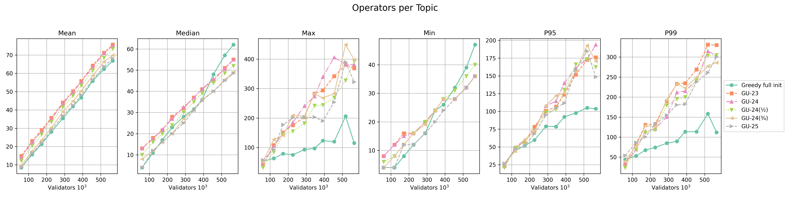
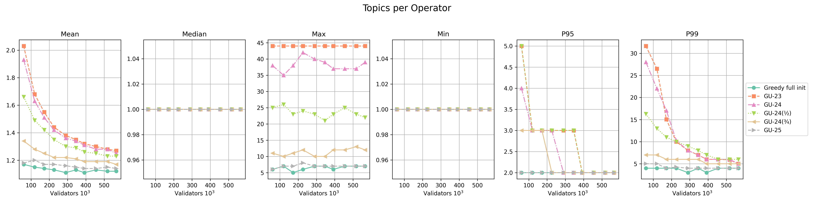
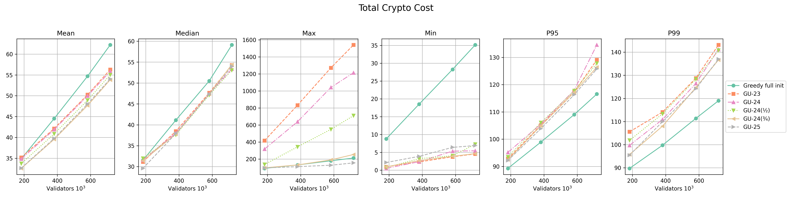
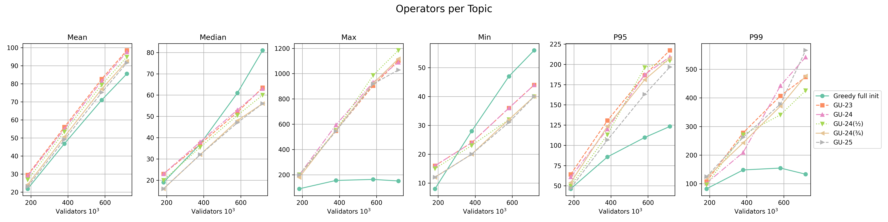
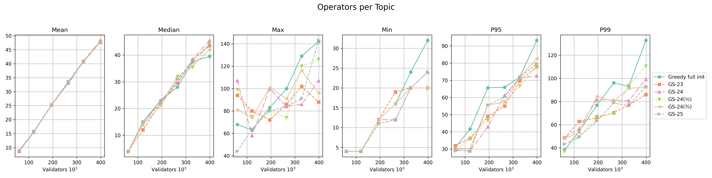
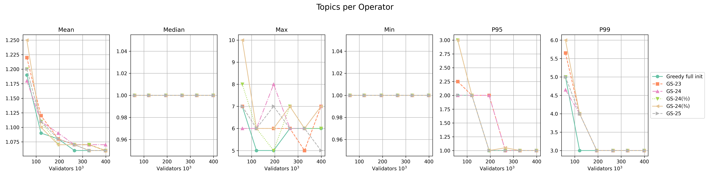

|     Author     |           Title            |  Category  |       Status        |    Date    |
| -------------- | -------------------------- | ---------- | ------------------- | ---------- |
| Matheus Franco | Network Topology           | Network    | open-for-discussion | 2024-03-06 |

## Table of Contents <!-- omit from toc -->
- [Summary](#summary)
- [Motivation](#motivation)
- [Goal](#goal)
- [Key Questions](#key-questions)
- [Solution Classes](#solution-classes)
- [Proposed Models](#proposed-models)
	- [1. Greedy Algorithm](#1-greedy-algorithm)
	- [2. MaxReach](#2-maxreach)
	- [3. LowestID](#3-lowestid)
- [Analysis](#analysis)
	- [Q1: Performance](#q1-performance)
	- [Q2: Viability](#q2-viability)
		- [Greedy: Event Processing Performance](#greedy-event-processing-performance)
		- [Greedy With Updates (`GU`)](#greedy-with-updates-gu)
		- [Scalability of `GU`](#scalability-of-gu)
		- [Greedy With Split (`GS`)](#greedy-with-split-gs)
- [Final Evaluation](#final-evaluation)


## Summary

This SIP proposes a new method for assigning committees to topics, aiming to reduce the number of irrelevant (non-committee) messages operators must process.

## Motivation

Currently, committee-to-topic assignment is random, using a hash of committee operators modulo 128:

```go
// Bytes -> Int -> Modulo 128
func CommitteeSubnet(cid spectypes.CommitteeID) uint64 {
	subnet := new(big.Int).Mod(new(big.Int).SetBytes(cid[:]), bigIntSubnetsCount)
	return subnet.Uint64()
}

// Operators -> Bytes -> Hash
func GetCommitteeID(committee []OperatorID) CommitteeID {
	// sort
	sort.Slice(committee, func(i, j int) bool {
		return committee[i] < committee[j]
	})
	// Convert to bytes
	bytes := make([]byte, len(committee)*4)
	for i, v := range committee {
		binary.LittleEndian.PutUint32(bytes[i*4:], uint32(v))
	}
	// Hash
	return sha256.Sum256(bytes)
}
```

This randomness forces operators active in many committees to listen to multiple topics and process many irrelevant messages, which limits scalability.

## Goal

Substitute for a model that groups committees that share operators into the same topics, so operators process fewer non-committee messages.

## Key Questions

<!-- no toc -->
1. [How do new models compare in cryptography cost, message rate, and topic sizes as the network scales?](#q1-performance)
2. [Are the models practical?](#q2-viability)
3. [Which model performs best overall?](#final-evaluation)

## Solution Classes

We classify models along three classes:

- **Stateless vs Stateful**: Does the assignment depend only on the committee ID (stateless) or the whole network state (stateful)?
- **Stable vs Unstable**: Does an event only affect its own committee assignment (stable) or others too (unstable)?
- **History Independent vs Dependent**: Is the final assignment consistent regardless of event order?

## Proposed Models

### 1. Greedy Algorithm

This stateful algorithm minimizes assignment cost using an objective function. Let:
- $v_c$ be the number of validators in the committee
- $v_t$ be the number of validators in the topic
- $O_c$ be the set of operators in the committee
- $O_t$ be the set of operators in the topic

The cost to add a committee is defined by the aggregation cost:

$$Agg(c,t) = | O_c \setminus O_t | \times v_t + | O_t \setminus O_c | \times v_c$$

This represents:
- **1st term**: each committee operator - not in the topic - will need to listen to all validators already added to the topic.
- **2nd term**: each topic operator not in the committee will need to listen to all committee validators.

**Initialization**:
- Sort committees by validator count.
- Assign the largest 128 committees to the 128 topics.
- Insert remaining committees greedily into the topic minimizing the above cost.

```r
procedure GREEDY_ALGORITHM(committees: set[Committee])
	topics = empty map[Topic -> set[Committee]]
	sorted = sort_committees_by_validator_count(committees)
	for i in 0 .. min(MAX_TOPICS, len(sorted)) - 1:
		topics[i].add(sorted[i])
	for c in sorted[MAX_TOPICS:]:
		best_topic = topic with minimal cost_of_adding_committee(c)
		topics[best_topic].add(c)
```

**Event Handling**:

- Adding a new committee: assign using insertion logic.
- Adding validators in existing committees: no topic change.
- Removing validators: no topic change, unless the committee is empty and, in that case, it's removed.

**Properties**: Stateful, stable, history-dependent.

### 2. MaxReach

This stateful model tracks each operator’s participation count in active committees.
In order to combine well-connected committee groups, a committee is assigned to a topic based on the operator with the **highest reach** (most committees).
The operator’s ID is hashed and mapped modulo 128.

**Properties**: Stateful, unstable, history-independent.

Note: It's unstable because adding a committee can change operator counts, affecting assignments of other committees. However, it shouldn't be very common.

### 3. LowestID

This stateless model simply assigns a committee to the topic corresponding to its operator with the lowest ID.

**Properties**: Stateless, (and thus) stable, history-independent.

## Analysis

### Q1: Performance

We benchmarked models using current Mainnet data (~80k validators, 1k operators, 647 committees) and simulated scaling up to 8x (both in number of validators and operators).

<p align="center">




</p>

The **cryptography cost** is measured for each operator and it takes into consideration the RSA cost of non-committee messages and the RSA + BLS cost of committee messages. Similarly, the **message rate** is measured for each operator taking into consideration all messages per epoch listened in all of its topics.

**Observations**:
- **Greedy** outperforms others, supporting 8x scalability on cryptography and message load.
- **MaxReach** goes second scaling up to 5x, but producing larger topics.
- **LowestID** shows minimal benefit, and, along with **MaxReach**, produces bigger topics as well as empty topics until a network 4x bigger.
- **Greedy** incurs higher computation cost with complexity $O(\text{sorting}) + O(\text{insertion}) = O(C \times log C) + O (C \times T) = O(C\, log C + C \times T)$, where $C$ is the number of committees and $T$ the number of topics.
  - The insertion time completely dominates the sorting one. For example, for a network 8x bigger, the sorting time was 300 $\mu s$ and the insertion took ~42 ms. This is reasonable since $log(C) \approx 9$ against $T = 128$, and the insertion comparison is more costly than a committee comparison.
  - Nonetheless, it's sufficiently fast for considerably large networks. E.g., in a network twice as big, the processing time is equivalent to 8 BLS verifications.

### Q2: Viability

- **LowestID** is stateless and simple, but ineffective at scale.
- **Greedy** and **MaxReach** require state synchronization:
  - Nodes must be synced to maintain assignment accuracy.
  - To reduce sync issues, events may be processed with a delay — the current implementation already waits for **8 eth1 blocks** before processing, giving nodes time to receive all relevant events.

For **Greedy**:
- It is **history-dependent**, meaning nodes must fetch the initial state and process all subsequent events.
- It's possible that incremental updates may gradually degrade assignment quality vs. a full re-run.
  - To prevent it, it may re-initialize periodically.
  - This solves the drift but adds systemic overhead.

**Greedy** is the most promising model.
Thus, we further evaluate it under continuous network updates to understand the necessity of re-initialization.


#### Greedy: Event Processing Performance

We compare:
- `Greedy full init`: full re-initialization on each event.
- `G-YY[(X)]`: initialize on date `20YY-12*X-01` and then process events incrementally.

<p align="center">

</p>

**Validator counts over selected dates**:
- 2023: 0
- 2024: 2k
- 2024/06: 22k
- 2024/09: 43k
- 2025: 60k

Results show that `G-23`, `G-24`, and `G-24(½)` significantly diverge from `Greedy full init` benchmark.
In contrast, `G-24(¾)` and `G-25` closely match its performance, suggesting that initializing from a state nearer to the present date is better.

#### Greedy With Updates (`GU`)

We further improve event processing by allowing committees to **update** their topic-assignments:
- When a validator is added to an existing committee, we remove the committee from its current topic and insert it into the newly selected best topic.
- All other operations remain unchanged.

This method preserves algorithm stability since it only reassigns topics for the committee affected by the event.

The complexity of the event processing operation changed from $O(1)$ to $O(T)$ since a comparison is made to each topic.

<p align="center">

</p>

The `GU-24(½)` variant comes closer to the `Greedy full init`.
More notably, `GU-24(¾)` and `GU-25` outperform even the benchmark in the 50k–60k validator range.
This indicates that `GU` is a viable Greedy variant: it avoids costly full re-initializations while maintaining — and even improving — performance.

#### Scalability of `GU`

To validate scalability, we replicated the network up to 7× its original size and observed the results:

<p align="center">



</p>

Key findings:
- While `GU-24(½)` diverged, both `GU-24(¾)` and `GU-25` consistently outperformed the benchmark as the network scaled.
- The superior results from `GU-25` might seem counterintuitive, but they highlight that default Greedy is only locally optimal. In contrast, `GU` reassesses committee-topic assignments more frequently, uncovering better local optima.
- The number of topics each operator subscribes to increases when starting from an older initial state.
- While average topic sizes remain similar, the maximum topic size grows when there's no re-initializations.

To better reflect future network growth, we scaled only the recent growth pattern observed between 60k and 90k validators:

<p align="center">



</p>

Observations:
- Only `GU-25` consistently maintained better results, though `GU-24(¾)` remained close to the full initialization baseline.
- Topic sizes and the number of topics per operator showed similar behaviour to the previous experiment.

#### Greedy With Split (`GS`)

In order to avoid the dependence on the initialization date, we increase the disturbance in the event processing functions attempting to let the model find a better local optima.
- When a validator is added to an existing committee, we **split** the committee's topic and merge the created subgroup to the best topic.
- Other operations remain unchanged.

The split operation is described in terms of the aggregation operation:
- While, on committee insertion, we looked for the topic that minimizes the aggregation cost, i.e. $\min_{t} Agg(c,t)$, in a split operation, we look for two subsets of the topic that maximize the aggregation cost of merging them, i.e. $Split(t) = \max_{t_1,t_2\subseteq t} Agg(t_1,t_2)$.
  - The intuition is that splitting should create the most different subsets, also implying that each subset is well-connected.
  - Note that, previously, we defined `Agg(c,t)` for a committee and a topic, but, here, we extrapolate the definition for two topics, $Agg(t_1,t_2)$.
- The complexity of the split operation is $O(2^{t_c})$ where $t_c$ is the number of committees in topic $t$.
  - Exactly as in the Greedy algorithm, we content ourselves with a faster algorithm that finds a local optima by sorting the topic committees, and inserting them in $t_1$ and $t_2$ in a greedy manner. Thus, the new complexity is $O(t_c \times log \, t_c)$.

This change turns the algorithm to be **unstable** since the split operation may change the topic of other committees

The complexity of the event processing becomes $O(t_c \times log \, t_c + T)$ due to the split operation and the comparison per topic.

```r
procedure ADD_VALIDATOR_TO_EXISTING_COMMITTEE(committee: Committee)
	committee_topic = topics.TopicForCommittee(committee)
	committee_topic.IncrementValidators(1)
	# Split
	t1, t2 = Split(committee_topic)

	# Best merge
	cost_of_keeping_the_same = Agg(t1,t2)
	best_topic, best_cost = topic with minimal Agg(t2, topic) # (Except for committee_topic)
	if cost_of_keeping_the_same < best_cost:
		return
	else:
		topics[committee_topic] = t1
		topics[best_topic].add_subtopic(t2)
```

<p align="center">



</p>

- All models performed very similarly in all metrics, indicating that the initialization date stopped playing a decisive role.
- On the other hand, the model became unstable and the average event processing time increased. A comparison of all models is shown in the next table.

| Model | Network Multiplier | Mean Event Time ($\mu s$) | Max ($ms$) | P95 ($\mu s$) | P99 ($\mu s$) |
|-------|--------------------|---------------------------|------------|-------------|-------------|
| `G`   | 1                  | 0.81                      | 0.20       | 1           | 2.5         |
| `GU`  | 1                  | 11.5                      | 0.14       | 17          | 26          |
| `GS`  | 1                  | 23.3                      | 0.70       | 101         | 192         |
|       |                    |                           |            |             |             |
| `G`   | 2                  | 0.81                      | 0.10       | 1           | 2.9         |
| `GU`  | 2                  | 13.2                      | 0.22       | 22          | 31          |
| `GS`  | 2                  | 40.5                      | 1.30       | 117         | 360         |
|       |                    |                           |            |             |             |
| `G`   | 3                  | 0.85                      | 0.21       | 1           | 3.4         |
| `GU`  | 3                  | 14.7                      | 2.40       | 27          | 54          |
| `GS`  | 3                  | 61.3                      | 4.18       | 208         | 526         |
|       |                    |                           |            |             |             |
| `G`   | 4                  | 0.88                      | 0.26       | 1           | 3.8         |
| `GU`  | 4                  | 16.1                      | 0.61       | 31          | 78          |
| `GS`  | 4                  | 82.9                      | 3.15       | 245         | 597         |


## Final Evaluation

When considering both performance and viability:
- **LowestID** is stateless but delivers the least improvement. Also, it's highly sensitive to the current, but ephemeral, network pattern.
- **MaxReach** achieves reasonable gains and and is practical with effective state management and syncing.
- **Greedy** offers the best performance but at the cost of having to process the full event history and being resource-intensive

Overall, **Greedy** emerges as the top choice because:
- Access to the full event history is guaranteed by the node implementation.
- Its heaviest operations can be optimized to complete in milliseconds.
- It delivers up to **8x scalability boost**.
- Its incremental event processing maintains consistent performance.

Important note: this scalability gain applies when the network grows in both validators and operators. If the validator count alone increases, the operational cost on operators rises linearly — and no topology model can mitigate that inherent scaling cost.
