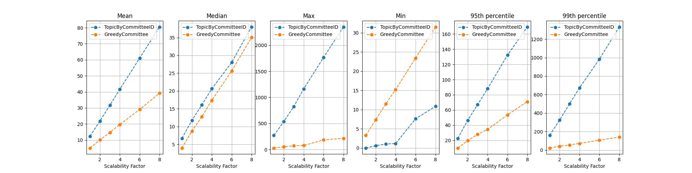

|     Author     |           Title            |  Category  |       Status        |    Date    |
| -------------- | -------------------------- | ---------- | ------------------- | ---------- |
| Matheus Franco | Network Topology           | Network    | open-for-discussion | 2024-03-06 |

## Summary

Modify the committee-topic assignment function using a greedy algorithm to minimize the number of non-committee messages an operator receives.

## Motivation

Currently, committees are assigned through topics in a random way.
This causes operators participating in many committees to listen to several topics, having to process a considerable fraction of non-committee messages.
Even though non-committee messages require less cryptographic processing, in total, they may represent a scalability barrier.

## Rationale

The current topic assignment function takes as input the `CommitteeID` of the committee, which is a hash of the byte array that represents the committee's operators.
Then, the function converts it to an integer and returns it modulo 128.
Due to the hashing operation, this function is similar to a *random* model.

```go
func CommitteeSubnet(cid spectypes.CommitteeID) uint64 {
	subnet := new(big.Int).Mod(new(big.Int).SetBytes(cid[:]), bigIntSubnetsCount)
	return subnet.Uint64()
}

func GetCommitteeID(committee []OperatorID) CommitteeID {
	// sort
	sort.Slice(committee, func(i, j int) bool {
		return committee[i] < committee[j]
	})
	// Convert to bytes
	bytes := make([]byte, len(committee)*4)
	for i, v := range committee {
		binary.LittleEndian.PutUint32(bytes[i*4:], uint32(v))
	}
	// Hash
	return sha256.Sum256(bytes)
}
```

To avoid the hurdles of the random model, this SIP proposels a greedy model that attempts to put committees with similar operators on the same topic.

## Improvement

We compared both models on the current Mainnet state which has 76k validators, 1k operators and 638 committees.
As metrics, the cryptography cost and listened message rate were measured for each operator in both models.
In the following table we summarizes the statistics comparison about these samples.

| Greedy / Topic by CommitteeID | Mean | Median | Max | Min    | 95th Percentile | 99th Percentile |
|-------------------------------|------|--------|-----|--------|-----------------|-----------------|
| Cryptography cost             | 88%  | 86%    | 52% | 1803%  | 67%             | 75%             |
| Message rate                  | 41%  | 59%    | 11% | 10650% | 45%             | 14%             |

We see that the mean and maximum costs were reduced, while the minimum one was increased.
This behaviour is expected by the greedy model as it spreads the cost of over-compromised operators to idle ones.

### Scalability

The biggest gain of the proposed model comes from the fact that the maximum operator cost doesn't increase much as the network increases (both in validators and operators), in contrast to the current model that degrades linearly.
This comes from the efficiency of the greedy model that assigns new committees in a way that minimizes the overall cost.

To compare the scalability of both models, we multiplied the current network by factors of 2, 3, 4, 6, and 8.
For example, the network multiplied by 2 has double the number of validators, operators, and committees, as if it were introduced fake validators and operators.

The next chart shows the increase of cryptography cost for both models.
<p align="center">

</p>

The next chart shows the increase of message rate for both models.
<p align="center">

</p>

According to the charts, the proposed model matches the original mean value for a network twice as big.
Looking at the maximum statistics, the proposed model matches the original for a network 8x bigger.
On the other hand, the minimum cost for the greedy model is always bigger due to its balancing nature.

## Algorithm

The algorithm is based on a cost function that represents the burden on adding a committee to a topic. Let:
- $V_c$ be the number of validators in the committee
- $V_t$ be the number of validators in the topic
- $O_c$ be the set of operators in the committee
- $O_t$ be the set of operators in the topic

The cost of adding the committee to such a topic is computed as:

$$| O_c \setminus O_t | \times V_t + | O_t \setminus O_c | \times V_c$$

The first term corresponds to the fact that each committee operator not in the topic will need to listen to all topic validators.
The second term corresponds to the fact that each topic operator not in the committee will need to listen to all committee validators.

The algorithm follows in a greedy pattern inserting committees in topics with minimum cost.

To initially fill in the topics, the algorithm sorts the committees according to their number of validators, and puts the spread the biggest 128 committees into the 128 topics. Then, it follows by adding each committee in a way that minimizes the cost function.

Below, it's shown the algorithm in Go with complexity $\mathcal{O}(C \log C + T \times C)$ where $C$ is the number of committees, and $T$ the number of topics.

```go

type Committee struct {
	operators  map[OperatorID]struct{}
	validators map[phase0.ValidatorIndex]struct{}
}

type TopicAssignment struct {
	topicMap         map[int]map[*Committee]struct{}
	operatorsInTopic map[int]map[OperatorID]struct{}
	maxTopics        int // Default: 128
}

func (t *TopicAssignment) Init(committees []Committee) {
	// Init topics
	topicIndex := 1
	for topicIndex <= t.maxTopics {
		t.topicMap[topicIndex] = make(map[*Committee]struct{})
		t.operatorsInTopic[topicIndex] = make(map[OperatorID]struct{})
		topicIndex += 1
	}

	// Sort committees by the number of validators in descending order
	SortCommittees(committees)

	// Insert the biggest committee in topic 1, the second biggest in topic 2, ..., until topic [maxTopics]
	committeeIndex := 0
	for committeeIndex < len(committees) {
		// Topic to be inserted
		insertionTopic := committeeIndex

		// Stop if reaches maxTopics
		if insertionTopic > t.maxTopics {
			break
		}

		// Insert committee in the topic
		t.topicMap[insertionTopic][&committees[committeeIndex]] = struct{}{}

		// insert committee operators
		for operatorID := range committees[committeeIndex].operators {
			t.operatorsInTopic[insertionTopic][operatorID] = struct{}{}
		}

		committeeIndex += 1
	}

	for committeeIndex < len(committees) {
		// Get topic with least impact
		topicWithLeastImpact := t.GetTopicWithLeastImpact(committees[committeeIndex])

		// Insert validators in the topic
		t.topicMap[topicWithLeastImpact][&committees[committeeIndex]] = struct{}{}

		// insert committee operators
		for operatorID := range committees[committeeIndex].operators {
			t.operatorsInTopic[topicWithLeastImpact][operatorID] = struct{}{}
		}

		committeeIndex += 1
	}

}

func (t *TopicAssignment) GetTopicWithLeastImpact(committee Committee) int {
	// init best
	bestTopic := 1
	bestCost := math.MaxInt

	for topicIndex, topicValidators := range t.topicMap {
		// compute cost
		equalOperators := NumberOfIntersectingOperators(committee.operators, t.operatorsInTopic[topicIndex]) // Compute intersection in O(n + m) time
		cost := 0
		cost += (len(committee.operators) - equalOperators) * len(topicValidators)                 // committee operators that don't belong to the topic will need to listen to all validators in the topic
		cost += (len(t.operatorsInTopic[topicIndex]) - equalOperators) * len(committee.validators) // topic operators that don't belong to the committee will need to listen to all validators in the committee

		// update
		if cost < bestCost {
			bestTopic = topicIndex
			bestCost = cost
		}
	}

	return bestTopic
}

// Compute intersection in O(min(n,m)) time
func NumberOfIntersectingOperators(set1, set2 map[OperatorID]struct{}) int {
	if len(set1) > len(set2) {
		set1, set2 = set2, set1 // Iterate over the smaller set
	}
	count := 0
	for op := range set1 {
		if _, exists := set2[op]; exists {
			count++
		}
	}
	return count
}

// Sort committees by the number of validators in descending order in O(n log n) time
func SortCommittees(committees []Committee) {
	sort.SliceStable(committees, func(i, j int) bool {
		// Compare by number of validators (descending order)
		vi, vj := len(committees[i].validators), len(committees[j].validators)
		if vi != vj {
			return vi > vj
		}
		// If equal, compare by number of operators (descending order)
		oi, oj := len(committees[i].operators), len(committees[j].operators)
		return oi > oj

		// If equal, compare the biggest OperatorID, the second biggest and so on ... (to ensure the ordering is the same for everyone)
	})
}
```

### Committee Addition

An addition of a committee works in the same way as in the main function body.

```go
func (t *TopicAssignment) AddCommittee(committee Committee) {
	// Get topic with least impact
	topicWithLeastImpact := t.GetTopicWithLeastImpact(committee)

	// Insert validators in the topic
	t.topicMap[topicWithLeastImpact][&committee] = struct{}{}

	// insert committee operators
	for operatorID := range committee.operators {
		t.operatorsInTopic[topicWithLeastImpact][operatorID] = struct{}{}
	}
}
```

### Committee Removal

The removal of a committee is as simple as removing it from the topic map.
A committee operator should be removed from the topic only if no other committee added such operator to it.

```go
func (t *TopicAssignment) AddCommittee(committee Committee) {

	// Remove committee
	topic := t.GetCommitteeTopic(committee)
	delete(t.topicMap[topic], &committee)

	// Remove operator only if no other committee added it to the topic
	for operatorID := range committee.operators {

		has_other_committee_in_such_topic := false

		for operator_committee := range t.GetCommitteesWithOperator(operatorID) {
			if (operator_committee != committee) {
				if topic == t.GetCommitteeTopic(operator_committee) {
					has_other_committee_in_such_topic = true
					break
				}
			}
		}

		if !has_other_committee_in_such_topic {
			delete(t.operatorsInTopic[topic], &operatorID)
		}
	}
}
```


## Viability

The model can be seen as a state machine that holds an initial committee-topic map and can be updated upon a committee addition or removal.

Any node in the network must agree on the current state so that the topic assingments are consistent between nodes.

A state machine replication can be achieved if:
1. the replicas agree on the initial state and on the order of the events (validator addition and removal).
2. the transition function is deterministic.

Regarding condition (1), it's possible that a replica misses an event and stores an outdated state.
To mitigate this issue, we can delay the event processing by some time interval to increase the probability of receiving all events before the time they should be processed.
This is already included in the implementation which sets the events to be processed only after 8 eth1 blocks.

Regarding condition (2), the operations in the transition function are well-defined and deterministic as seen above.

We must highlight that the model is not "history independent".
I.e., it's not determined by the current state, but rather on the initial one and all events after it.
I.e., letting $S_0$ be a state, $E$ an event, and $S_f = S_0 + E$, the algorithm doesn't necessarily provide the same output when executed on $S_f$ as when executed on $S_0$, and, then, processed $E$.

## Open questions

- Is there an efficient algorithm that is "history independent", i.e. only depends on the current state?
- Are there more optimized addition and removal functions that are "stable" (i.e., doesn't impact other committees' assingments)?