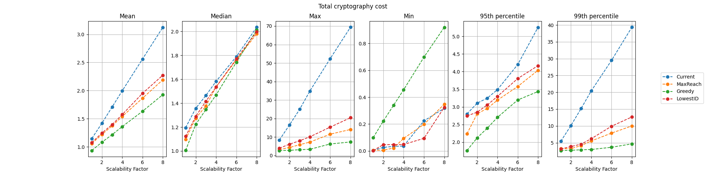
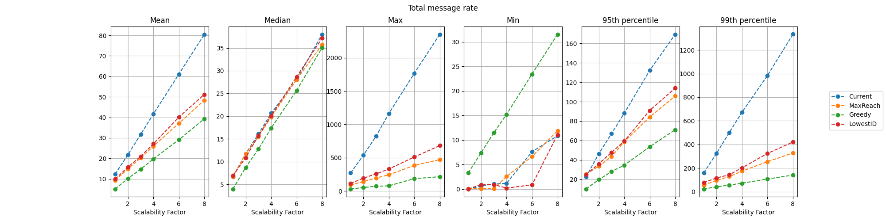
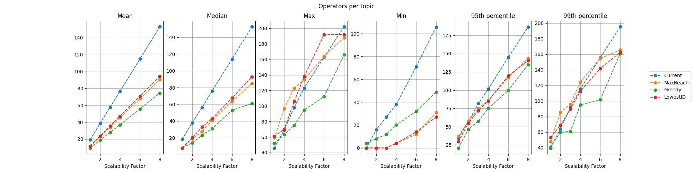
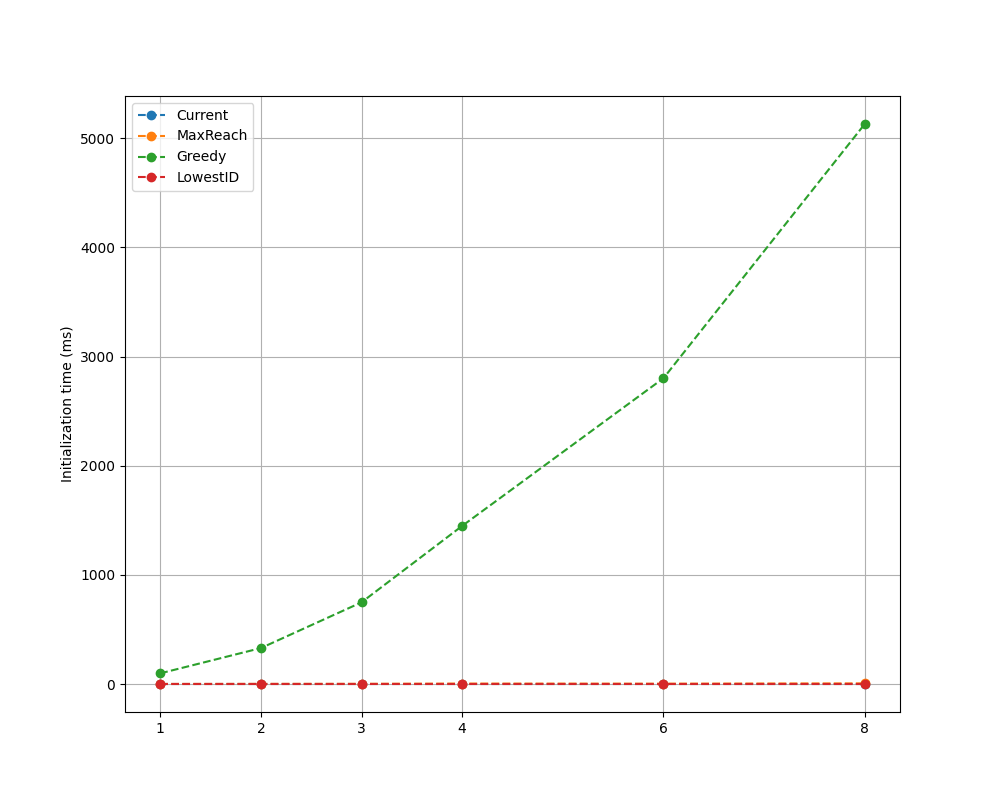
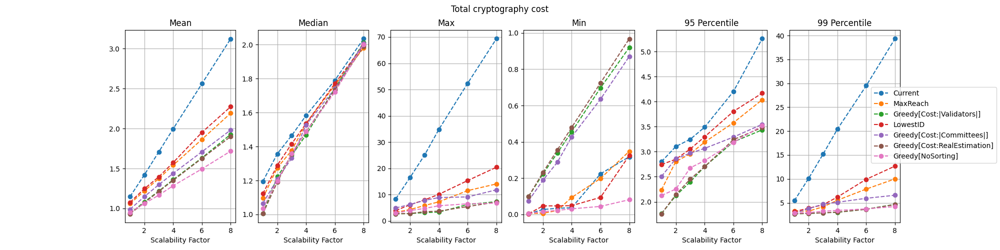
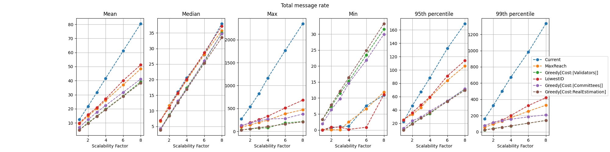
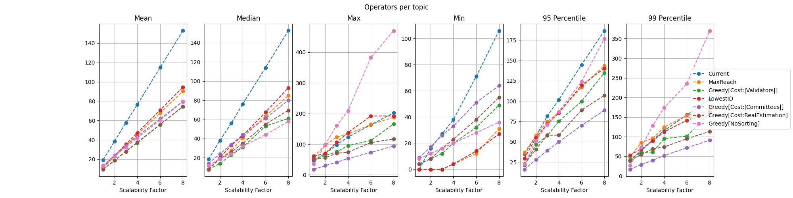

|     Author     |           Title            |  Category  |       Status        |    Date    |
| -------------- | -------------------------- | ---------- | ------------------- | ---------- |
| Matheus Franco | Network Topology           | Network    | open-for-discussion | 2024-03-06 |

## Table of Contents <!-- omit from toc -->
- [Summary](#summary)
- [Motivation](#motivation)
- [Rationale](#rationale)
- [Research Questions](#research-questions)
- [Solution Classes](#solution-classes)
- [Models](#models)
	- [Greedy Algorithm](#greedy-algorithm)
	- [MaxReach](#maxreach)
	- [LowestID](#lowestid)
- [Analysis](#analysis)
	- [Q1: How each model compares to the current model on cryptography cost, message rate, and topic size for increasing network sizes?](#q1-how-each-model-compares-to-the-current-model-on-cryptography-cost-message-rate-and-topic-size-for-increasing-network-sizes)
	- [Q2: What is the viability of each model?](#q2-what-is-the-viability-of-each-model)
	- [Q3: What is the best performing viable model?](#q3-what-is-the-best-performing-viable-model)
- [Conclusion](#conclusion)
- [Greedy: Further Analysis](#greedy-further-analysis)
	- [Processing Time Profile](#processing-time-profile)
	- [Variations](#variations)


## Summary

Modify the committee-topic assignment function to reduce the number of non-committee messages an operator receives.

## Motivation

Currently, committees are assigned to topics in a random way.
The function starts by taking as input the `CommitteeID` of the committee, which is the hash of the byte array that represents the committee's operators.
Then, it converts the ID to an integer and returns it modulo 128.

```go
func CommitteeSubnet(cid spectypes.CommitteeID) uint64 {
	subnet := new(big.Int).Mod(new(big.Int).SetBytes(cid[:]), bigIntSubnetsCount)
	return subnet.Uint64()
}

func GetCommitteeID(committee []OperatorID) CommitteeID {
	// sort
	sort.Slice(committee, func(i, j int) bool {
		return committee[i] < committee[j]
	})
	// Convert to bytes
	bytes := make([]byte, len(committee)*4)
	for i, v := range committee {
		binary.LittleEndian.PutUint32(bytes[i*4:], uint32(v))
	}
	// Hash
	return sha256.Sum256(bytes)
}
```

Due to the hashing operation, this function behaves similarly to a random model.
This causes operators participating in many committees to listen to several topics, having to process a considerable fraction of non-committee messages.
Even though non-committee messages require less cryptographic processing, in total, they may represent a scalability barrier.

## Rationale

To solve the stated issue, the proposed model should take into account the similarity between committees, i.e. committees that share operators should be grouped together.

## Research Questions

In the following sections, we explore several models and compare them to the current one.
To guide the analysis, we defined the following questions:
<!-- no toc -->
1. [How each model compares to the current model on cryptography cost, message rate, and topic size for increasing network sizes?](#q1-how-each-model-compares-to-the-current-model-on-cryptography-cost-message-rate-and-topic-size-for-increasing-network-sizes)
2. [What is the viability of each model?](#q2-what-is-the-viability-of-each-model)
3. [What is the best performing viable model?](#q3-what-is-the-best-performing-viable-model)

## Solution Classes

Before proceeding to the proposed models, first, we have define important classes of solutions that will dictate the viability of the models.

The first classification regards the dependence on the whole state of the network:
- *Stateless*: the assignemnt of a committee is independent of any other committee, i.e. it's independent of an state.
- *Stateful*: the assignment of a committee is dependent on the other committees that belong to the network.

Committees may be created, destroyed, or have their number of validators changed.
Therefore, we're faced with a dynamical problem, meaning that the assignment of committees are not final and may change over time.
This gives rise to two classes of solutions:
- *Stable*: the processing of an event will only change the assignment of the event's committee.
- *Unstable*: events may change the assignemnt of other committees.

Another important property is whether processing events in different orders produce different outputs.
This is encompassed in the following two classes:
- *History independence*: the final state of the assignment function is only dependent on the current system's state. I.e. the initial system state and the order by which new events are processed are irrelevant.
- *History dependence*: the final state of the assignment function depends on the initial system's state and the order by which new events are processed.

## Models

### Greedy Algorithm

This algorithm is based on a cost function that represents the burden on adding a committee to a topic. Let:
- $v_c$ be the number of validators in the committee
- $v_t$ be the number of validators in the topic
- $O_c$ be the set of operators in the committee
- $O_t$ be the set of operators in the topic

The cost of adding the committee to such a topic is computed as:

$$| O_c \setminus O_t | \times v_t + | O_t \setminus O_c | \times v_c$$

The first term corresponds to the fact that each committee operator not in the topic will need to listen to all validators already added to the topic.
The second term corresponds to the fact that each topic operator not in the committee will need to listen to all committee validators.

The algorithm follows in a greedy pattern inserting committees in topics with minimum cost.

To initially fill in the topics, the algorithm sorts the committees according to their number of validators, and spreads the biggest 128 committees into the 128 topics.
Then, it follows by adding each committee in a way that minimizes the cost function.

```r
procedure GREEDY_ALGORITHM(committees: set[Committee])
	topics: map[Topic -> set[Committee]]

	# Sort committees
	sorted_committees = sort_committees_by_number_of_validators(committees) # in reverse order

	# Insert biggest committees (from 0 to MAX_TOPICS - 1)
	current_committee = 0
	while current_committee < MAX_TOPICS and current_committee < len(sorted_committees):
		topics[current_committee].add(sorted_committees[current_committee])
		current_committee += 1

	# For each remaining committee, insert it in the topic with minimal cost
	while current_committee < len(sorted_committees):
		best_topic = -1
		best_topic_cost = -1
		for topic in 0 ... MAX_TOPICS - 1:
			cost = cost_of_adding_committee_to_topic(topics, topic, sorted_committees[current_committee])
			if best_topic == -1
				best_topic, best_topic_cost = topic, cost
			else
				if cost < best_topic_cost:
					best_topic, best_topic_cost = topic, cost

		topics[best_topic].add(sorted_committees[current_committee])
		current_committee += 1
```

For dealing with events:
- the removal of a committee works by simply removing the committee from the topic.
- the addition of a new committee works similarly to the addition of the remaining committees.
- in case a committee changes its number of validators, no assignment changes.

This model is stateful, stable and history dependent.

### MaxReach

This model holds a state with all network operators linked to the number of active committees it participates.
This map shows how well connected through committees an operator is.
The model explores this idea by setting the topic for a committee to be defined by the operator with largest map value.
Similarly to the current model, it's computed the hash of the operator ID and then it's converted to an integer modulo 128.

This model is stateful and history independent, as it only depends on the current state.
It shouldn't be very common, but the addition of a committee changes the map value for its operator, which may cause another committee to have a new operator as the one with maximum reach, making the model unstable.

### LowestID

This model simply sets the topic for a committee to be determined by its operator with lowest identifier.
Again, it computes the hash and converts to an integer modulo 128.

This model is stateless and, consequentially, history independent and stable.

## Analysis

### Q1: How each model compares to the current model on cryptography cost, message rate, and topic size for increasing network sizes?

For the system configuration, we took the current Mainnet state with 76k validators, 1k operators and 638 committees.
Then, we "copied and pasted" the network to create bigger samples, with 2x, 3x, 4x, 6x, and 8x the size of the default one.

<p align="center">




</p>

- Taking maximum cryptography cost as the scalability barrier, the greedy algorithm is the best performing one with a scalability factor of 8x. The MaxReach algorithm is the second best with a scalability factor of 5x. The same holds for message rate.
- MaxReach and LowestID produce bigger topics when compared to the greedy algorithm, though they show empty topics until a network 4 times bigger.
- The greedy algorithm is the most costly one due to its $O(C\, log C + C \times T)$ complexity, where $C$ is the number of committees and $T$ the number of topics. However, the processing time is considerably low for the upcoming network sizes. For example, for a network twice as big, the processing time is equivalent to 8 BLS verifications.

### Q2: What is the viability of each model?

Except from the LowestID, which is stateless, both the gredy and the MaxReach algorithms require a state maintainance.

This means that nodes should be synced on the network events in order to have the accurate assignment of topics.
To mitigate synchronization issues, we can delay the event processing by some time interval to increase the probability of all nodes receiving all events before the time they should be processed.
This is already included in the implementation which sets the events to be processed only after 8 eth1 blocks.

The greedy algorithm is history independent, and it would force new users to be able to retrieve the initial state and process all new events after it, even if the same committee was added and later removed.
A deeper observation is that this dependency is associated with a degrading performance.
The algorithm's result on $S_0 + E_1 + E_2 + ... + E_n$ is likely to be worse than its result if applied on the final state $S_f$, as the ordering done in the initialization would take into account removed committees.
Both of these problems motivates a periodical re-initialization of the algorithm, i.e. setting a newest state as the initial state checkpoint.
The simplest solution is to re-initialize every epoch.
If this complexity is undesirable, idle periods can wait longer, e.g. 100 epochs, until the intial state is reset.
As the new initial state, the previous epoch's state was chosen because the restarting epoch's state may be inconsistent between nodes.

### Q3: What is the best performing viable model?

While the greedy algorithm is the best performing model, but it also imposes periodical re-initialization due to its history dependence and performance degradation.

The MaxReach model, on the other hand, provides a decent performance with a faster processing, while not being history dependent, i.e. doesn't having to to re-initializations.
Its unstability may be considered rare as well as non-damaging due to the syncing assumptions.

## Conclusion

In order to solve the issues raised by the random assignment function,
we propose the [Greedy](#greedy-algorithm) model as it provides a ~8x scalability boost.
Note that this scalability dimension regards the network increase both in number of validators and operators.
For scalability on increasing solely the number of validators, the duties cost on operators increases linearly and no network topology model can have an effect on it.

Even though the model requires the maintainance of a state, it consists of relatively cheap operations that shouldn't counter balance the improvements.

## Greedy: Further Analysis

### Processing Time Profile

The greedy algorithm is composed of two steps:
- sorting the committees list ($O (C \times log C)$)
- inserting each committee computing the cost for every topic ($O (C \times T)$)

From the execution time profile, the insertion time completely dominates the sorting one.
For example, for a network 8x bigger, the sorting time was 300 $\mu s$ and the insertion took ~42 ms.

This is reasonable since $log(C) ~ 9$ against $T = 128$, and the insertion cost calculation is more costly than a comparison of committees.

### Variations

We analysed two variations in terms of how cost is computed:
- `Cost:|Committees|`: the cost function takes into account the number of committees, instead of the number of validators. For insertion, this variation doesn't need to track the validators of a committee requiring less data to be stored, though the number of validators is used in the sorting phase.
- `Cost:RealEstimation`: instead of the numebr of validators, the cost function uses the estimated non-committee cost of all committees given their number of validators and operators, taking into account committee consensus as well as single validator duties.

`Cost:|Validators|` shall denote the original version of the greedy algorithm.

<p align="center">



</p>

- `Cost:RealEstimation` performs similarly to the original model, showing that the extra cost estimation step may be unnecessary.
- `Cost:|Committees|` has a worse performance, close to `MaxReach`, probably due to the lack of information on the committees' sizes.