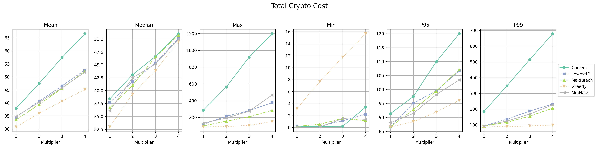

|     Author     |           Title            |  Category  |       Status        |    Date    |
| -------------- | -------------------------- | ---------- | ------------------- | ---------- |
| Matheus Franco | Network Topology           | Network    | open-for-discussion | 2024-03-06 |

## Table of Contents <!-- omit from toc -->
- [Summary](#summary)
- [Motivation](#motivation)
- [Spec Change](#spec-change)
- [Alternative Solutions](#alternative-solutions)
	- [1. Greedy Algorithm](#1-greedy-algorithm)
	- [2. MaxReach](#2-maxreach)
	- [3. LowestID](#3-lowestid)
- [Comparisons](#comparisons)


## Summary

This SIP proposes to useMinHash for assigning committees to topics, aiming to reduce the number of irrelevant (non-committee) messages operators must process.

## Motivation

Currently, committee-to-topic assignment is random, using a hash of committee operators modulo 128 (number of topics):

```go
// Bytes -> Int -> Modulo 128
func CommitteeSubnet(cid spectypes.CommitteeID) uint64 {
	subnet := new(big.Int).Mod(new(big.Int).SetBytes(cid[:]), bigIntSubnetsCount)
	return subnet.Uint64()
}

// Operators -> Bytes -> Hash
func GetCommitteeID(committee []OperatorID) CommitteeID {
	// sort
	sort.Slice(committee, func(i, j int) bool {
		return committee[i] < committee[j]
	})
	// Convert to bytes
	bytes := make([]byte, len(committee)*4)
	for i, v := range committee {
		binary.LittleEndian.PutUint32(bytes[i*4:], uint32(v))
	}
	// Hash
	return sha256.Sum256(bytes)
}
```

This randomness forces operators active in many committees to listen to multiple topics and process many irrelevant messages, which limits scalability. 

In contrast, MinHash assigns committees to topics based on the minimum hash of the committee operators. This increases the probability of committees being assigned to the same topic when they have most of their operators in common.

With MinHash, the probability of two committees getting the same topic is the number of shared operators over the number of total operators.

## Spec Change
For each committee, we assign a topic based on the minimum hash of the committee operators.

```go
func AssignCommitteeToTopic(committee []OperatorID) uint64 {
	minHash := uint64(math.MaxUint64)
	for _, id := range committee {
		hash := sha256(id)
		if hash < minHash {
			minHash = hash
		}
	}
	return minHash % NUM_TOPICS
}
```

## Alternative Solutions

### 1. Greedy Algorithm

This stateful algorithm minimizes assignment cost using an objective function. Let:
- $v_c$ be the number of validators in the committee
- $v_t$ be the number of validators in the topic
- $O_c$ be the set of operators in the committee
- $O_t$ be the set of operators in the topic

The cost to add a committee is defined by the aggregation cost:

$$Agg(c,t) = | O_c \setminus O_t | \times v_t + | O_t \setminus O_c | \times v_c$$

**Initialization**:
- Sort committees by validator count.
- Assign the largest 128 committees to the 128 topics.
- Insert remaining committees greedily into the topic minimizing the above cost.

**Event Handling**:

- Adding a new committee: assign using insertion logic.
- Adding validators in existing committees: no topic change.
- Removing validators: no topic change, unless the committee is empty and, in that case, it's removed.

**Properties**: Stateful, stable, history-dependent.

### 2. MaxReach

This stateful model tracks each operator’s participation count in active committees.
In order to combine well-connected committee groups, a committee is assigned to a topic based on the operator with the **highest reach** (most committees).
The operator’s ID is hashed and mapped modulo 128.

**Properties**: Stateful, unstable, history-independent.

Note: It's unstable because adding a committee can change operator counts, affecting assignments of other committees. However, it shouldn't be very common.

### 3. LowestID

This stateless model simply assigns a committee to the topic corresponding to its operator with the lowest ID.

**Properties**: Stateless, (and thus) stable, history-independent.

## Comparisons

<p align="center">

</p>

The plot above shows a comparison among the current solution, the MinHash algorithm, and the alternative solutions.
The MinHash algorithm is chosen based on the considerations of both performance and simplicity (being stateless and history-independent).

