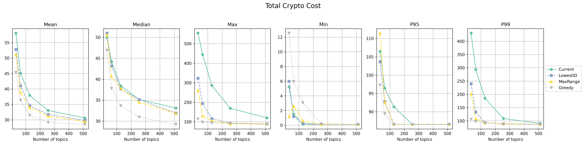
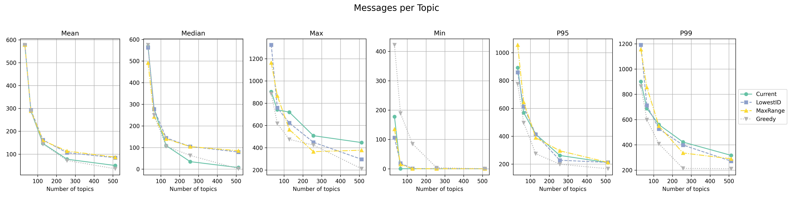
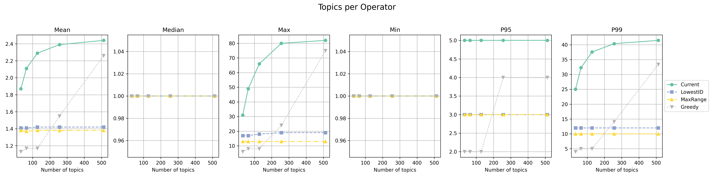
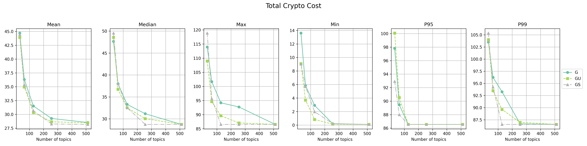
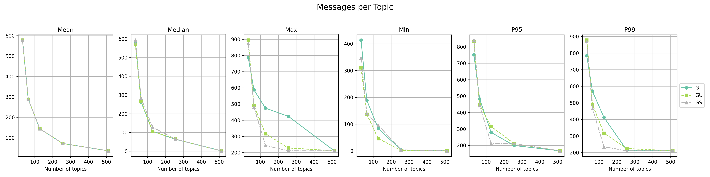
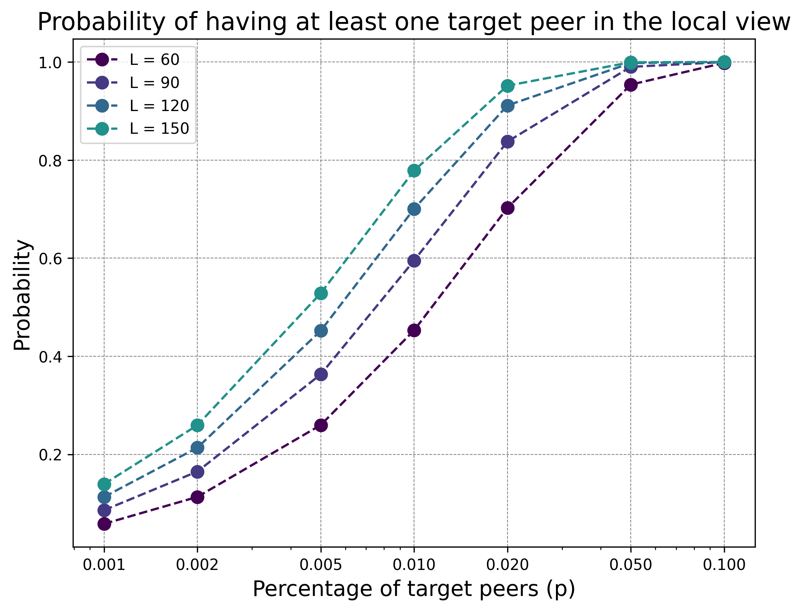
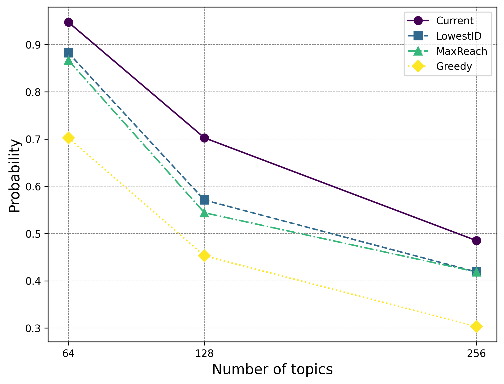

|     Author     |      Title       | Category |       Status        |    Date    |
| -------------- | ---------------- | -------- | ------------------- | ---------- |
| Matheus Franco | Number of Topics | Network  | open-for-discussion | 2025-05-19 |

## Table of Contents <!-- omit from toc -->
- [Summary](#summary)
- [Motivation](#motivation)
- [Metrics](#metrics)
  - [GossipSub Layer](#gossipsub-layer)
  - [Protocol Layer](#protocol-layer)
  - [Discovery Layer](#discovery-layer)
- [Conclusion](#conclusion)

## Summary

This SIP aims to find the best number of topics according to load-balancing trade-offs and its impact on the discovery and GossipSub layers.

## Motivation

Currently, the GossipSub layer uses 128 topics for load-balancing.
However, this number has never been target of research.
Thus, we want to explore if another value better suits the protocol needs.

## Metrics

We shall use the following metrics:
- [Protocol layer](#protocol-layer) cost, e.g. cryptography cost imposed on operators according to the topic assignment model.
- [GossipSub layer](#gossipsub-layer) memory and processing.
- [Discovery layer](#discovery-layer) complexity.

### GossipSub Layer

We analyse the memory complexity for several GossipSub objects.

```go
mesh         map[string]map[peer.ID]struct{}
```

[`mesh`](https://github.com/libp2p/go-libp2p-pubsub/blob/0c5ee7bbfeb051200bc39eb824246cc651f7358a/gossipsub.go#L468) grows linearly with the number of subscribed topics, but this doesn't necessarily grow linearly with the total number of topics.

```go
fanout       map[string]map[peer.ID]struct{}
topics map[string]map[peer.ID]struct{}
```

[`fanout`](https://github.com/libp2p/go-libp2p-pubsub/blob/0c5ee7bbfeb051200bc39eb824246cc651f7358a/gossipsub.go#L469) and [`topics`](https://github.com/libp2p/go-libp2p-pubsub/blob/0c5ee7bbfeb051200bc39eb824246cc651f7358a/pubsub.go#L132) seems to grow linearly with the total number of topics. However, it actually depends on how frequent peers appear in more than one topic. If increasing the number of topics reduces the number of topics subscribed by peers, the impact can be reduced.

```go
type MessageCache struct {
	msgs    map[string]*Message
	peertx  map[string]map[peer.ID]int
	history [][]CacheEntry
	gossip  int
	msgID   func(*Message) string
}
type FirstSeenCache struct {
	lk  sync.RWMutex
	m   map[string]time.Time
	ttl time.Duration

	done func()
}
```

[`MessageCache`](https://github.com/libp2p/go-libp2p-pubsub/blob/0c5ee7bbfeb051200bc39eb824246cc651f7358a/mcache.go#L38) and [`FirstSeenCache`](https://github.com/libp2p/go-libp2p-pubsub/blob/0c5ee7bbfeb051200bc39eb824246cc651f7358a/timecache/first_seen_cache.go#L10) grows with the number of received messages, which can actually reduce as the number of topics grows.

```go
type RPC struct {
	Subscriptions []*RPC_SubOpts
	Publish       []*Message
	Control       *ControlMessage
}
```

[`RPC`](https://github.com/libp2p/go-libp2p-pubsub/blob/0c5ee7bbfeb051200bc39eb824246cc651f7358a/pb/rpc.pb.go#L26) is the structure sent over the wire.
`RPC.Control` grows with the number of received messages and subscribed topics, `RPC.Message` with the number of received messages, and `Subscriptions` with the number of subscribed topics.

```go
type peerStats struct {
	topics map[string]*topicStats
}
```

[`peerStats`](https://github.com/libp2p/go-libp2p-pubsub/blob/0c5ee7bbfeb051200bc39eb824246cc651f7358a/score.go#L17) is stored for each peer and keeps track of scoring registers.
Even though a peer may not participate in every topic, `peerStats.topics` grows linearly with the total number of topics as well as the processing cost of the [`score`](https://github.com/libp2p/go-libp2p-pubsub/blob/0c5ee7bbfeb051200bc39eb824246cc651f7358a/score.go#L265) function for calculating the score of a peer.


In conclusion, the data for peer score and its processing grow linearly with the number of topics.

### Protocol Layer

We evaluated all topic assignment models described in the network topology SIP.

<p align="center">




</p>

- For the maximum cryptography cost, gains are observed until ~256 topics.
- `MaxReach` and `LowestID` keep a regular number of topics subscribed per operator, while `Greedy` grows linearly.


<p align="center">


</p>

- For the Greedy variants, also most cryptography max cost gains were observed until ~256 topics.

### Discovery Layer

A node only connects to a small subset of all peers in the network.
Namely, the current node implementation restricts to 60 peers.
Therefore, a larger number of topics may make it harder to find peers that participate in a topic of interest.

Formally, if there are $N$ peers, a peer's local view consists of $L$ of them, and the peer is interested in a fraction of $p$, then the probability of finding at least one is

$$\mathbb{P}[\text{at least one}] = 1 - \frac{comb((1-p)N)}{comb(N,L)} \approx 1 - (1-p)^L$$


<p align="center">

</p>

For all models, the minimum number of operators per topic is 4. This represents a total of 3 target peers. In a network with 1k operators, the probability is $\approx$ 17%.

Using the average topic sizes from the protocol layer chart, we estimated the probability for each model and number of topics pair.

<p align="center">

</p>

Increasing to 256 topics considerably reduces the probability of finding target peers.

As mitigation techniques:
- We can increase $L$ though it consumes more memory and it's not as impactful as the $p$ fraction.
- Improve the local view by removing irrelevant peers. For that, the node implementation has already added a peer selection heuristic that prunes irrelevant peers according to a scoring mechanism that depends on the number of shared subnets.

## Conclusion

- GossipSub Layer: Scoring data and processing grows linearly with the number of topics.
- Protocol Layer: There are cryptography gains up to 256 topics.
- Discovery Layer: Increasing the number of topics reduce the probability of finding relevant peers.

Though cryptography cost can be improved with more topics, the discovery layer imposes scalability barriers which motivate keeping the number of topics as is.
