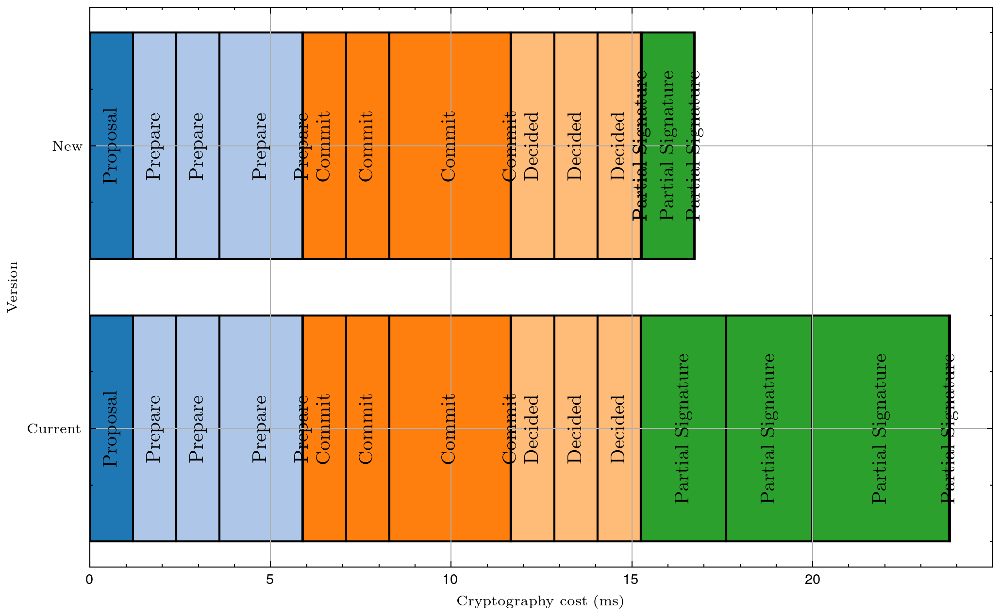

|     Author     |                   Title                    | Category |       Status        |    Date    |
| -------------- | ------------------------------------------ | -------- | ------------------- | ---------- |
| Matheus Franco | Partial Signature Verification Aggregation | Core     | open-for-discussion | 2024-03-19 |

[Discussion](https://github.com/bloxapp/SIPs/discussions/38)

## Summary

This SIP aims to reduce cryptography costs. It accomplishes that by proposing to do only one BLS verification for the quorum of partial signature messages.

## Motivation

Cryptography is, commonly, the biggest processing overhead in distributed systems. In our case, the BLS scheme is used which is also one of the heaviest cryptography protocols. Thus, performing one BLS verification for each in-committee message represents an important scalability barrier.

## Rationale

### 1st change

A partial signature message implies one RSA verification (in the message validation layer) and two BLS verifications (for `SignedPartialSignatureMessage` and `PartialSignatureMessage`). Notice that two signatures are used to verify that the sender is correct and one is used to verify if the (same) sender correctly signed the beacon partial signature. Therefore, we can, simply, ignore the first BLS signature since the RSA signature is already being checked.

Notice that the operator must still BLS-sign twice for previous version compatibility.

### 2nd change

For the partial signature phases, action is only triggered when a quorum of valid messages is received. It's common for systems of such nature that use BLS to take advantage of its fast verification property. So, instead of verifying each message, we verify the batch with a quorum of messages. This can be done by reconstructing the validator's signature and verifying it. If the validator's signature is wrong, then at least one of the signatures is wrong and we need to fall back. For that, one can loop the signatures and verify each, removing the incorrect ones. Once a new quorum is reached, the same procedure is done.

## Improvements

For the attestation duty case (the most frequent one), the new cryptography cost is reduced to $77$% of the current value, a 1.3x boost.

The cryptography costs of the duty's steps are shown below.

<p align="center">

</p>


## Spec change

### Partial signature message processing

The `BaseRunner`'s `validatePartialSigMsgForSlot` function should be changed in order not to verify the BLS signatures.

```go
func (b *BaseRunner) validatePartialSigMsgForSlot(
	signedMsg *types.SignedPartialSignatureMessage,
	slot spec.Slot,
) error {
	if err := signedMsg.Validate(); err != nil {
		return errors.Wrap(err, "SignedPartialSignatureMessage invalid")
	}
	if signedMsg.Message.Slot != slot {
		return errors.New("invalid partial sig slot")
	}

	// Removed
	/*
	if err := signedMsg.GetSignature().VerifyByOperators(signedMsg, b.Share.DomainType, types.PartialSignatureType, b.Share.Committee); err != nil {
		return errors.Wrap(err, "failed to verify PartialSignature")
	}

	for _, msg := range signedMsg.Message.Messages {
		if err := b.verifyBeaconPartialSignature(msg); err != nil {
			return errors.Wrap(err, "could not verify Beacon partial Signature")
		}
	}
	*/
	return nil
}
```

In the duty runners' `ProcessPostConsensus` and `ProcessPreConsensus` functions, once a quorum is reached, we should attempt to reconstruct and verify the validator's signature. If an error is received, we must fall back, as shown below.

```go
// Example of post-consensus function for the aggregator duty runner
func (r *AggregatorRunner) ProcessPostConsensus(signedMsg *types.SignedPartialSignatureMessage) error {

	// ...

	if !quorum {
		return nil
	}

	for _, root := range roots {
		sig, err := r.GetState().ReconstructBeaconSig(r.GetState().PostConsensusContainer, root, r.GetShare().ValidatorPubKey)
		if err != nil {
			// Removed
			/*
			return errors.Wrap(err, "could not reconstruct selection proof sig")
			*/

			// New
			// If reconstructing and verification failed, fall back to verifying each partial signature
			r.BaseRunner.FallBackToVerifyingEachSignature(r.GetState().PostConsensusContainer, root)
			return errors.Wrap(err, "got post-consensus quorum but it has invalid signatures")
		}
		// ...
	}
	// ...
}

// Fall back function
func (b *BaseRunner) FallBackToVerifyingEachSignature(container PartialSigContainer, root [32]byte) {

	signatures := container.GetSignatures(root)

	for operatorID, signature := range signatures {
		if err := b.verifyBeaconPartialSignature(operatorID, signature, root); err != nil {
			container.Remove(root, operatorID)
		}
	}
}
```

## Drawbacks

In the current version, we verify the BLS signature of each message once it is received and, thus, we also drop it immediately if it's wrong. So, if we were to receive two signatures from the same signer, we would store only the correct one (if any). With this proposal, we would need to decide what to do with the signatures, since we don't know which is correct. For that, we could follow one of the following approaches:
1. verify the duplicated signatures and store the single correct one (if any).
2. randomly drop one of them.
3. store and try both until a quorum of signers is reached.

The first approach implies signature verification (what we are trying to reduce), but it's the safest one and, thus, it should be the one adopted. Also, this represents an uncommon case and, therefore, the practical effects are negligible.
