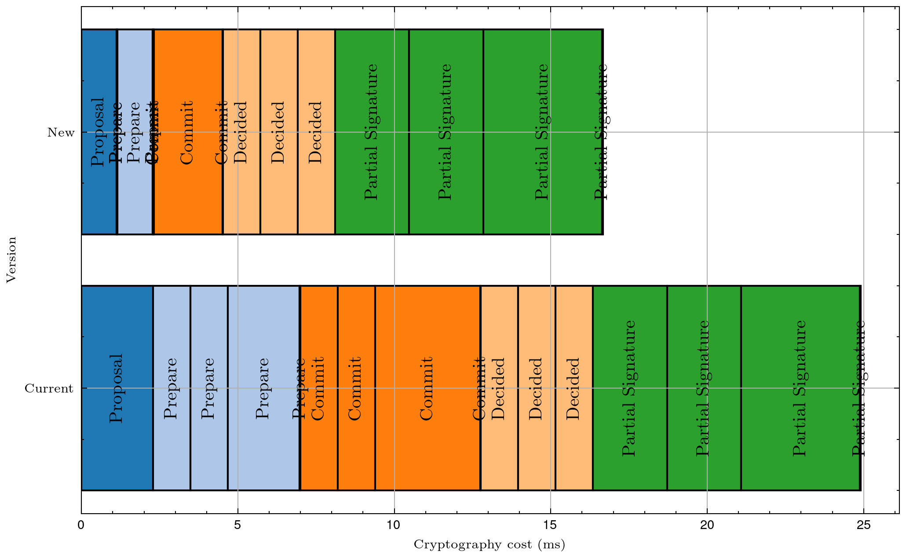

|     Author     |           Title           | Category |       Status        |    Date    |
| -------------- | ------------------------- | -------- | ------------------- | ---------- |
| Matheus Franco | QBFT - Drop redundant BLS | Core     | open-for-discussion | 2024-03-27 |

[Discussion](https://github.com/bloxapp/SIPs/discussions/38)

## Summary

Remove redundant BLS verification in QBFT.

## Motivation

BLS verification is the most costly operation in the protocol. Thus, for scalability purposes, it's fundamental to drop all redundant verification calls.

## Rationale

In the Message Validation module, the RSA signature is already checked to verify that the claimed signer is really the creator of the message. This check has an equivalent purpose to the BLS check in the `SignedMessage` structure. Thus, the more costly BLS check is redundant.

Nonetheless, the verification must be kept for two cases:
- messages contained in justifications
- decided messages

This is due to the fact that the contents of such messages are signed by different operators. So, we can't rely on the RSA signature to validate them.

## Improvements

For the attestation duty case (the most frequent one), the new cryptography cost is reduced to $62$% of the current value, a 1.6x boost.

The cryptography costs of the duty's steps are shown below.


<p align="center">

</p>


## Spec change

The `BaseValidation` functions of each message type can be split into a `NoVerification` and a `WithVerification` versions. The `WithVerification` calls the `NoVerification` and performs the BLS verification.

So, for example, the *commit* base validation would become:
```go
func baseCommitValidationWithVerification(
 	config IConfig,
 	signedCommit *SignedMessage,
 	height Height,
 	operators []*types.Operator,
 ) error {

 	if err := baseCommitValidationNoVerification(signedCommit, height, operators); err != nil {
 		return err
 	}

 	// verify signature
 	if err := signedCommit.Signature.VerifyByOperators(signedCommit, config.GetSignatureDomainType(), types.QBFTSignatureType, operators); err != nil {
 		return errors.Wrap(err, "msg signature invalid")
	}
	return nil
}


 func baseCommitValidationNoVerification(
 	signedCommit *SignedMessage,
 	height Height,
	operators []*types.Operator,
) error {

    // Similar to the original
	if signedCommit.Message.MsgType != CommitMsgType {
		return errors.New("commit msg type is wrong")
	}
	if signedCommit.Message.Height != height {
		return errors.New("wrong msg height")
	}
	if err := signedCommit.Validate(); err != nil {
 		return errors.Wrap(err, "signed commit invalid")
 	}

    // New
    // Add a check to confirm that the signer belongs to the committee
 	if !signedCommit.CheckSignersInCommittee(operators) {
 		return errors.New("signers not in committee")
 	}

    // No BLS Verification

 	return nil
}
```

The `CheckSignersInCommittee` can be defined in the following way:
```go
// Check if all signedMsg's signers belong to the given committee in O(n+m)
 func (signedMsg *SignedMessage) CheckSignersInCommittee(committee []*types.Operator) bool {
 	// Committee's operators map
 	committeeMap := make(map[uint64]struct{})
 	for _, operator := range committee {
 		committeeMap[operator.OperatorID] = struct{}{}
 	}

 	// Check that all message signers belong to the map
 	for _, signer := range signedMsg.Signers {
 		if _, ok := committeeMap[signer]; !ok {
 			return false
 		}
 	}
 	return true
}
```

Notice that these changes need to be implemented for:
- *prepare* messages: since they are received both in the raw version and nested into *round-change* and *proposal* justifications.
- *commit* messages: since they are received both in the raw version and aggregated into a *decided* message.
- *round-change* messages: since they are received both in the raw version and nested into a *proposal* justification.

The *proposal* base validation can just drop the BLS verification since it's never nested by any other messages.

The *Instance*'s `BaseMessageValidation` function should call the `NoVerification` version, while to validate justifications or decided messages, the ´WithVerification` version should be called.

## Drawbacks

No drawbacks could be found yet.