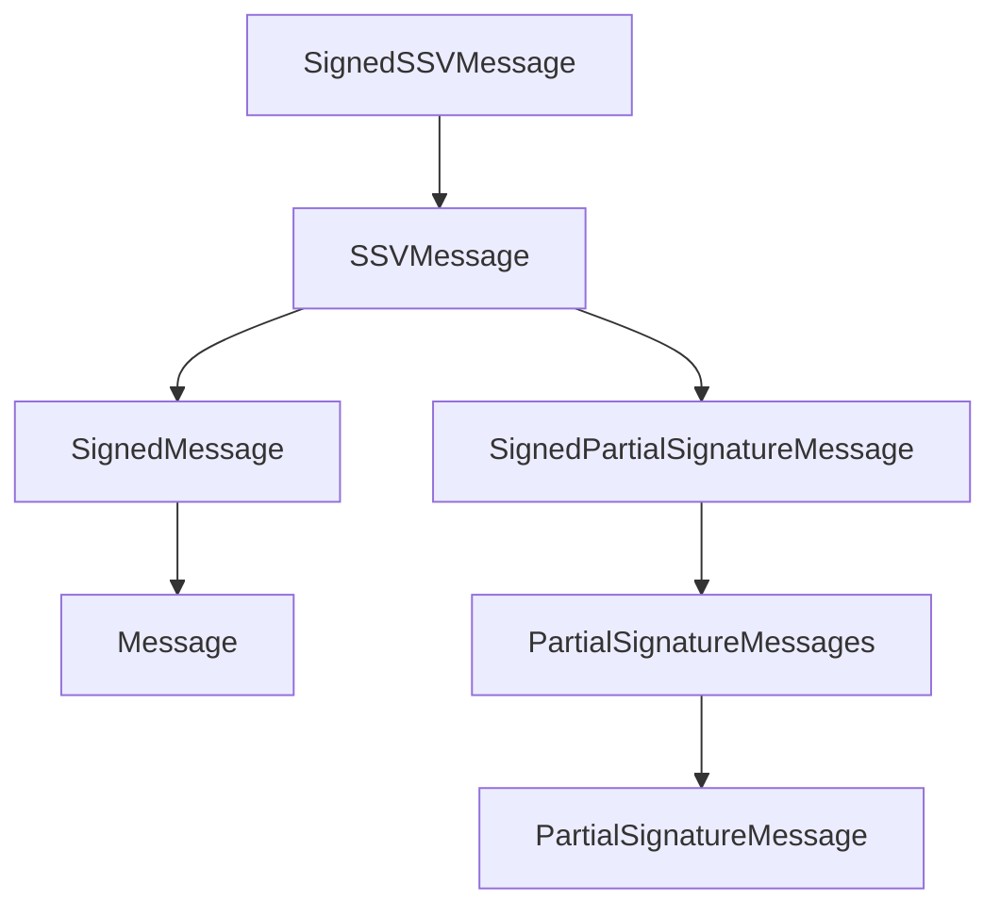
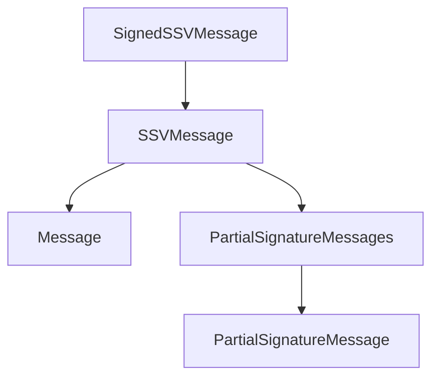

|     Author     |          Title           | Category |       Status        |    Date    |
| -------------- | ------------------------ | -------- | ------------------- | ---------- |
| Matheus Franco | Reduce Signatures - Fork | Core     | open-for-discussion | 2024-03-15 |

[Discussion](https://github.com/bloxapp/SIPs/discussions/38)

## Summary

Move the `FullData` of the `SignedMessage` type into the `Message` type and use a common wrapper for consensus and partial signature messages.

## Motivation

Reduce the cryptography cost by replacing BLS with RSA as the common wrapper signature type.

## Rationale

Currently, the hierarchy of message structures is as follows.



The `SignedSSVMessage`, `SSVMessage`, `SignedMessage` and `SignedPartialSignatureMessage` types are shown below.

```go
type SignedSSVMessage struct {
	OperatorID OperatorID
 	Signature  []byte // RSA Signature
 	Data       []byte
}
type SSVMessage struct {
	MsgType MsgType
	MsgID   MessageID
	Data 	[]byte
}
type SignedMessage struct {
	Signature 	types.Signature // BLS Signature
	Signers   	[]types.OperatorID
	Message 	Message
	FullData 	[]byte
}
type SignedPartialSignatureMessage struct {
	Message   PartialSignatureMessages
	Signature Signature // BLS Signature
	Signer    OperatorID
}
```

Notice that `SignedSSVMessage` implies the verification of a RSA signature while `SignedMessage` and `SignedPartialSignatureMessage` imply the verification of a BLS signature. Also, notice that the differences between `SignedMessage` and `SignedPartialSignatureMessage` lie in the `FullData` field and the number of signers that `SignedMessage` allows (for *decided* messages).

A better approach would be to directly link `SSVMessage` to `Message` or `PartialSignatureMessages`, as shown below.



For that, it's required to move `FullData` into the `Message` type and allow `SignedSSVMessage` to have multiple signers and signatures, to handle *decided* messages (since RSA signatures can't be aggregated).


## Improvements

For every in-committee message, the cost of verifying a BLS signature is removed, i.e. 1177 $\mu$s. Thus, wrappers for in-committee messages would only cost one RSA verification, i.e. 17 $\mu$s.

Moreover, upon a message creation, the cost of signing both with BLS and RSA keys, i.e. $530\mu$s + $570\mu$s, would be replaced by the cost of signing just with the RSA keys, i.e. $570\mu$s.


## Spec change

### Message structures

We propose dropping both `SignedMessage` and `SignedPartialSignatureMessage` types and include the `FullData` field into the `Message` type as follows.

```go
type Message struct {
	MsgType    MessageType
	Height     Height
	Round      Round
	Identifier []byte `ssz-max:"56"`

	Root                     [32]byte `ssz-size:"32"`
	DataRound                Round
	RoundChangeJustification [][]byte `ssz-max:"13,65536"`
	PrepareJustification     [][]byte `ssz-max:"13,65536"`

	FullData []byte `ssz-max:"5243144"` // New field
}
```

To handle *decided* messages, we also propose allowing multiple signers and signatures in the `SignedSSVMessage`.


```go
type SignedSSVMessage struct {
	OperatorID []OperatorID
 	Signature  [][]byte
 	Data       []byte
}
```

### Decided messages

With the proposed change, a *decided* message is identified by a `SignedSSVMessage` message with multiple signers and signatures.

**Creation**: To create a *decided* message, no BLS aggregation is performed anymore. Now, the commit message data is sent under `SignedSSVMessage.Data` and the quorum (or more) of signers are listed in `SignedSSVMessage.OperatorID` along with their respective signatures in `SignedSSVMessage.Signature`.

**Verification**: To verify a decided message, no more BLS verification is performed. Now, the number of signatures in `SignedSSVMessage.Signature` should be greater or equal to the cluster's quorum and the n-th signature should be correct for the public key of the n-th signer of `SignedSSVMessage.OperatorID` for $n = 0, 1, ..., len(Signatures) - 1$.


### Consensus message processing

The consensus module currently accepts `SignedMessage` messages. Now, it must accept `SignedSSVMessage` messages. `SignedSSVMessage` is required instead of the simple `Message` in order to allow the creation of messages with justifications.

Except by messages inside justifications, the consensus module should not verify the signature of the received `SignedMessage` since it assumes that the message validation module already performed this check.

Every sub-processing function of the consensus module, such as the `UponProposal`, `UponPrepare`, etc, should also receive a `SignedSSVMessage` instead of the deprecated `SignedMessage`.

The message container must also stop storing `SignedMessage` objects in favor of storing `SignedSSVMessage` objects.

### Partial signature message processing

Currently, the partial signature processing functions accept a `SignedPartialSignatureMessage`. Now, it should accept a `SignedSSVMessage`. Similarly to the consensus module, it should assume that the message validation module already verified the RSA signature.

### Validator

Currently, the `Validator` module receives an `SSVMessage` object as the input to its `ProcessMessage` function. Now, it should receive a `SignedSSVMessage`. Moreover, it should pass the same `SignedSSVMessage` object to the consensus and partial signature processing functions (and not one of its child types).

### Runner

Aligned to the changes on the `Validator` module, the `Runner` module should accept only `SignedSSVMessage` messages to its processing functions.

### Message Validation

Message validation should stop decoding the `SignedSSVMessage` to the deprecated `SignedMessage` or `SignedPartialSignatureMessage`. To check the content of the message it must decode the message data directly to one of the `Message` or `PartialSignatureMessages` types.

Message validation should only allow multiple signers in the `SignedSSVMessage` message for *decided* messages (a check that was previously done for the `SignedMessage` type). It should verify it according to the [description above](#decided-messages).

## Drawbacks

No drawbacks could be found yet.
