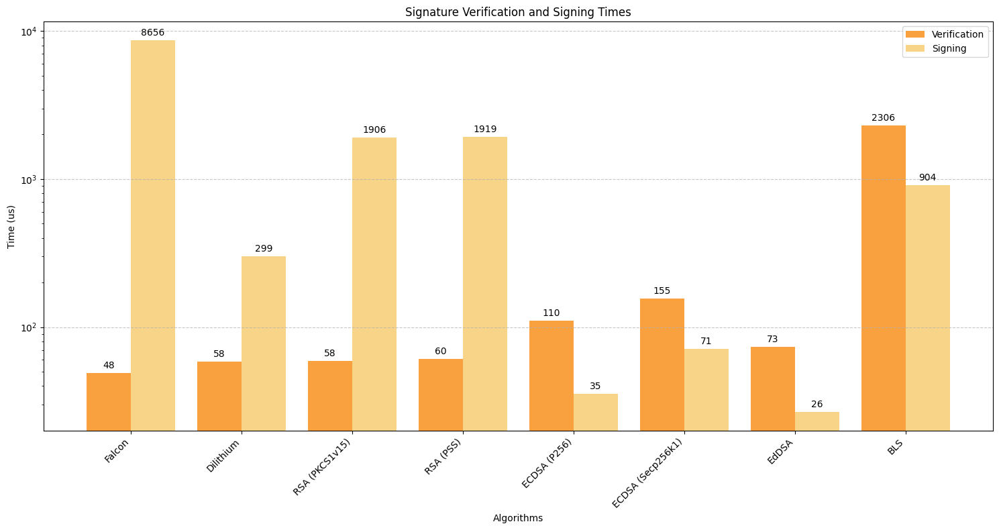
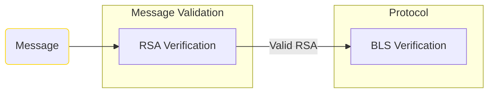

|     Author     |           Title            |  Category  |       Status        |    Date    |
| -------------- | -------------------------- | ---------- | ------------------- | ---------- |
| Matheus Franco | RSA Message Authentication | Networking | open-for-discussion | 2023-10-08 |

## Summary

In the current setup, our protocol employs BLS signatures for message authentication in the peer-to-peer (P2P) network. However, this process is resource-intensive and limits the scalability of the network, especially when dealing with a large volume of messages. To address this problem, this proposal suggests replacing BLS verification with RSA verification, in the message validation module, aiming to enhance network scalability and reduce message processing time.

## Motivation

The primary motivation behind this proposal is the need to improve the scalability of our network. More validators imply more messages and more signature verifications. As we anticipate an increase in the number of messages processed by our network, it is imperative to explore more efficient alternatives to the costly BLS verification operation.

## Rationale

The rationale behind adopting a better message authentication algorithm lies in comparing multiple algorithms' performance and security.

Below, it's shown the results of a benchmark test in Go 1.19 for several authentication algorithms, using 4 cores of Apple M1 Pro processors.

Besides the better performance of RSA, this scheme is also the most straightforward to implement due to the already existing operator's RSA network key.

Its security is approved by the [US National Institute of Standard and Technology (NIST)](https://www.nist.gov) as in their [Security Policy](https://csrc.nist.gov/CSRC/media/projects/cryptographic-module-validation-program/documents/security-policies/140sp4172.pdf) released in 2023 July.

This drastic reduction in processing time ensures that the network can handle a larger volume of messages for the same computational resources, enhancing overall network scalability without compromising security standards.

## Drawbacks

- Signature Size Concerns: Currently, BLS signatures occupy 96 bytes. Including an RSA signature with 2048-bit keys would add an extra 256 bytes ($\approx 2.6$ times more). This enlargement could escalate the size of network messages, potentially affecting bandwidth and message transmission times.

## Message Authentication Steps

RSA signatures may be used for message authentication in the network but the protocol still needs to use the BLS scheme for the beacon duties. Therefore, message authentication is divided into two steps:
1. Once received in the message validation module, the message's **RSA signature** is verified using the **operator's network key**.
2. If the RSA signature is valid and the receiver node participates in the duty, the message's **BLS signature** is verified using the operator's **BLS public key**, in the protocol module.

## Message Structure Change

The previous message structure, `SSVMessage`, doesn't contain a field for an RSA signature and, therefore, it shall be encapsulated into a higher structure to support it. It can be done using the following byte message partition:

| Field     | Size (Bytes) |
|-----------|--------------|
| Signature | 256          |
| ID        | 8            |
| Message   | -            |

## Appendix

### A1 - Security Considerations

The following security and design considerations should be thoroughly addressed:

1. Key Length and Security: The security of RSA encryption is highly dependent on the length of the key used. For instance, shorter keys are more vulnerable to brute-force attacks. The [US National Institute of Standard and Technology (NIST)](https://www.nist.gov) approves a minimum of 2048-bit RSA keys. Check the first table of section 1.5 of their [Security Policy](https://csrc.nist.gov/CSRC/media/projects/cryptographic-module-validation-program/documents/security-policies/140sp4172.pdf), released in 2023 July, for this reference.
2. Padding Schemes: RSA signatures require the use of padding schemes to ensure security. Poorly implemented or outdated padding schemes can expose the system to padding oracle attacks, where an attacker can gain unauthorized access to encrypted data. Employing secure padding schemes, such as PKCS#1 v1.5 or PSS, is essential to prevent these vulnerabilities. For the current implementation, PKCS#1 v1.5 will be used.
3. Compliance and Standards: Ensure that the implementation adheres to industry standards and best practices, such as those outlined by NIST and other relevant regulatory bodies. Compliance with established standards helps validate the security of the RSA implementation and provides assurance against common vulnerabilities and exploits.
4. Abstraction to handle Cryptographic Agility: While RSA is currently a widely accepted encryption and digital signature algorithm, the field of cryptography is constantly evolving. It's important to design the system with cryptographic agility in mind, allowing for the future transition to more secure algorithms if necessary. It's worth noting that RSA, despite its prevalence, is among the most targeted cryptographic schemes. For instance, elliptic curve cryptography is often recommended due to its enhanced security features. However, even these might fall by the wayside with the impending rise of quantum computers, compelling a transition to advanced alternatives like Dilithium or Falcon.

### A2 - Performance results

The results presented in the rationale section were obtained using Go 1.19 with 4 cores of Apple M1 Pro processors.

However, it's important to emphasize that values may change depending on the Go version. For example, Go 1.20 and 1.21 had a major impact on the RSA scheme, as can be seen here:
- [Issue: crypto/rsa: Some severe performance regressions in Go 1.20](https://github.com/golang/go/issues/59442)
- [Issue: crypto/rsa: severe VerifyPKCS1v15 performance regression in Go 1.20, Go 1.21](https://github.com/golang/go/issues/63516)

To avoid the current hurdles with "crypto/rsa", we can also utilize [Microsoft's Go-Crypto-OpenSSL library](https://github.com/microsoft/go-crypto-openssl) which showed good performance results ($\approx 16 \mu s$ for signature verification).
