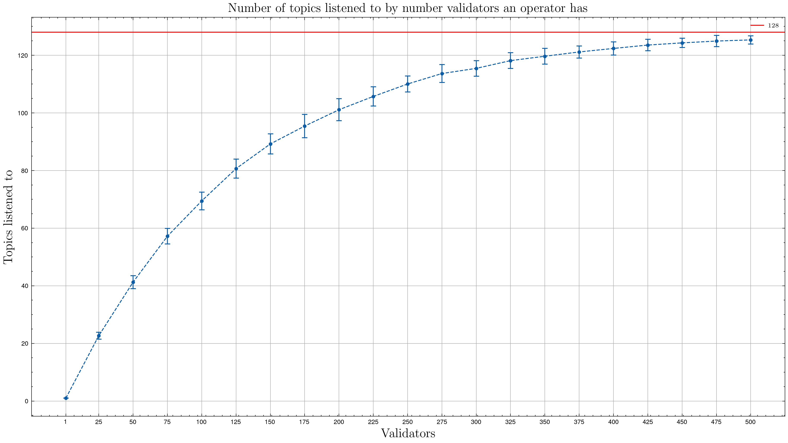
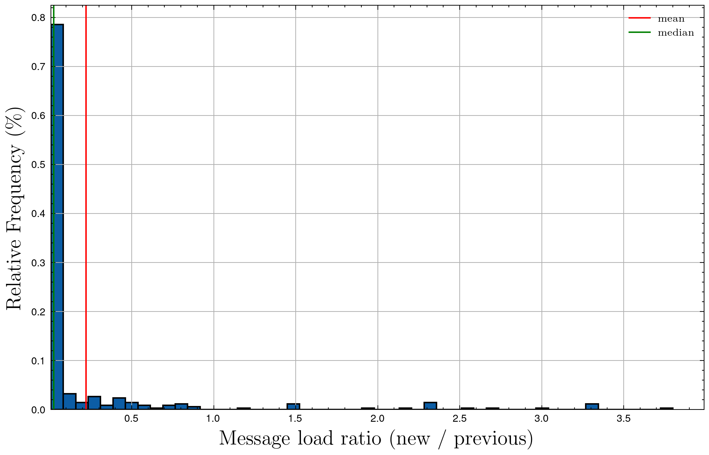
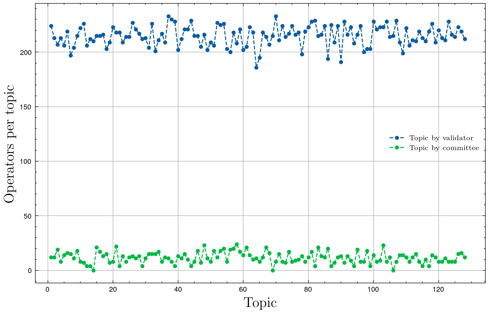
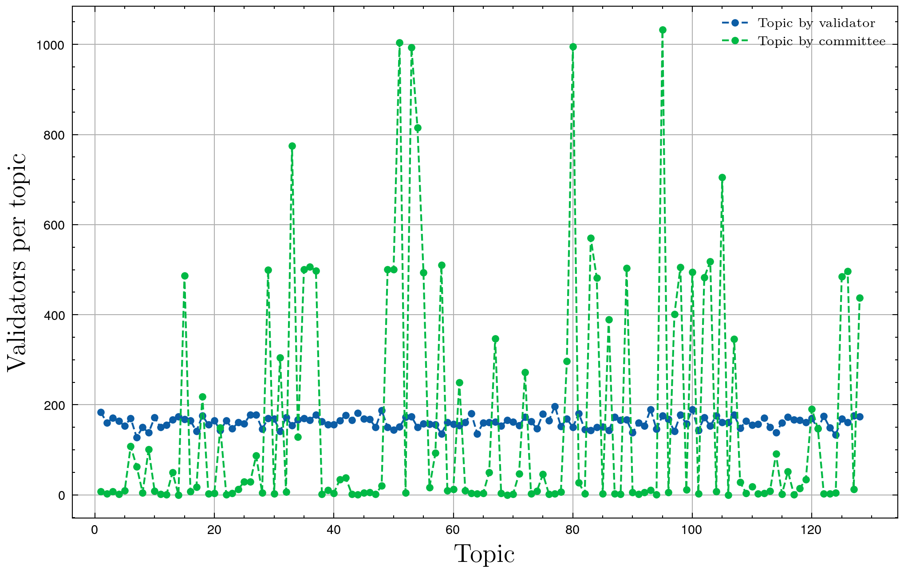

|     Author     |         Title         | Category |       Status       |    Date    |
| -------------- | --------------------- | -------- | ------------------ | ---------- |
| Matheus Franco | Topic by committee ID | Core     | open for dicussion | 2024-05-21 |


## Summary

This SIP aims to reduce the message rate processed by operators through the change of how validators are assigned to topics. Until now, the validator's assigned topic used to be computed using the `ValidatorPublicKey`. Instead, we propose using the `CommitteeID`.

## Motivation

An operator with many validators may be forced to listen to several different topics, as shown in the figure below.
This means that the operator will be listening to almost all the messages exchanged in the network.

<p align="center">

</p>

## Rationale

In Mainnet, it's common to have big committees that manage several validators. As we saw before, this implies that these operators will end up listening to almost every topic. It would be preferable if all the messages of such a big committee were to be exchanged on the same topic. In this case, the operators would only listen to a single topic (or a few more if they also participate in other committees).

This can be accomplished by changing how a validator is assigned to its topic. Instead of setting the assigned topic as a function of the validator's public key ($Topic: PublicKey \to \{1, ..., 128\}$), we set it to be a function of the validator's committee ($Topic: Committee \to \{1, ..., 128\}$).

Notice that, while previously an operator would listen to at most as many topics as its number of validators, now it listens to at most the number of committees it belongs to.

## Code change

Before, to compute a validator's topic. We used to do:
```go
topicID := hexToUint64(validatorPKHex[:10]) % subnetsCount
```

We suggest changing it to:
```go
type CommitteeID [32]byte
// Return a 32 bytes ID for the committee of operators
func getCommitteeID(committee []OperatorID) CommitteeID {
	// sort
	sort.Slice(committee, func(i, j int) bool {
		return committee[i] < committee[j]
	})
	// Convert to bytes
	bytes := make([]byte, len(committee)*4)
	for i, v := range committee {
		binary.LittleEndian.PutUint64(bytes[i*4:], uint64(v))
	}
	// Hash
	return CommitteeID(sha256.Sum256(bytes))
}
func CommitteeSubnet(cid spectypes.CommitteeID) int {
    subnet := new(big.Int).Mod(new(big.Int).SetBytes(cid[:]), new(big.Int).SetUint64(subnetsCount))
    return int(subnet.Int64())
}
topicID := CommitteeSubnet(getCommitteeID(committee))
```

## Performance impacts

We conducted Monte Carlo simulations to better understand the performance impact of such change. In such simulations, for both scenarios, we measured **how many duties an operator would listen to per slot** and **how many duties a topic would handle per slot**.

|       Model        | mean(Duties in a topic) | median(Duties in a topic) | mean(Duties an operator listens to) | median(Duties an operator listens to) |
| ------------------ | ----------------------- | ------------------------- | ----------------------------------- | ------------------------------------- |
| Topic by Validator | 5.04                    | 5.03                      | 402.5                               | 569.6                                 |
| Topic by Committee | 5.04                    | 0.4                       | 26.8                                | 15.5                                  |


If we compare the average number of duties an operator listens to between the two scenarios, we get

$$\frac{\text{mean(Duty rate per operator with topic per committee)}}{\text{mean(Duty rate per operator with topic per validator)}} = 0.066$$

In other words, a 93.4% reduction.

However, a more conservative metric is the ratio between the maximum number of duties an operator listens to in both scenarios. For this metric, we get:

$$\frac{\text{max(Duty rate per operator with topic per committee)}}{\text{max(Duty rate per operator with topic per validator)}} = 0.47$$

This means that, after the change, the maximum number of duties an operator will listen to will be around 47% of the current maximum, implying a scalability factor of 2.12 (using the number of messages as the scalability metric).

We analyzed the message load ratio (new/previous rate of listened duties) for each operator. The histogram is presented below.

<p align="center">

</p>

On average, each operator will listen to 2.5% of the current amount of messages. Notice that some operators would start listening to more messages (ratio > 1). However, this is not a problem because these are, usually, small operators who were not listening to many messages before.

At last, we also estimated the new numbers of operators and validators per topic, which are shown below.

<p align="center">


</p>

It can be seen that the number of operators in a topic drops drastically, while the number of validators per topic is way less uniform. Even though there are topics with much more validators than before, remember that the duty rate an operator listens to still drops significantly.

## Drawbacks

The proposed change has the following drawbacks:
- There can be topics with only 4 operators. In the GossipSub level, this means that the target mesh size of 8 won't be reached.
- The distribution of validators per topic won't be uniform anymore. Thus, it can happen that two big committees "collide" on the same topic. In this case, a heavy-loaded topic will be created even though there could exist "almost empty" topics at the same time. However, note that, for this case, once the committee-based consensus optimization is merged, a topic with two big committees won't be heavy-loaded anymore because the number of messages will decrease drastically.
